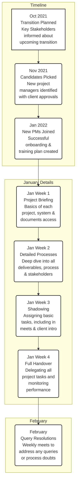

## 1

=== PAGE 1 ===

**Image Description:**
A close-up photograph showing a doctor in a white coat handing a blister pack of pills to a patient. The doctor's right hand is holding the orange and white blister pack, with his index finger pointing to one of the pills. The patient's left hand is open, ready to receive the medication. A stethoscope is visible around the doctor's neck. The background is slightly blurred. The overall image suggests a healthcare professional providing medication and advice to a patient.

**Logo in top right corner:**
A stylized 'T' shape composed of three blocks: a large blue vertical block, a smaller cyan horizontal block on top of it, and a magenta horizontal block to the right of the cyan block.

**Text Content:**

indegene<sup>TM</sup>

ICAP Rotation 1
End-term Review - Tanmay

---
=== PAGE 2 ===

Overview

**ICAP Rotation 1**
End to end project management for 2 key accounts in India

**Quantifiable Outcomes**
1. End to end project management and client interaction
2. Maintaining high customer satisfaction
3. Further BD/Mining opportunity, if any

**Assignment Leader**
Gurpinder Singh, AVP Growth Markets

**Executive Sponsor**
Marut Setia, SVP Emerging Markets & Devices

---

**Project 1: BSVwithU**

**Client:** Bharat Serums & Vaccines Limited
**MSA Value:** 1311952 USD
**Duration:** Aug '20 – Aug ‘23
**Key Objective:** One stop knowledge portal of Women's Health & Fertility doctors

---

**Project 2: Sanofi Connect**

**Client:** Sanofi India
**Value:** 235226 USD
**Duration:** Jan ‘21 – Mar '22
**Key Objective:** Digital Outreach for two mature brands to GP/CPs not met by Sanofi field force

---

indegene

---
=== PAGE 3 ===

**Navigation Header:**
[Overview] [BSV Key Tasks (active)] [BSV Results] [Sanofi Key Tasks] [Sanofi Results] [BU Lessons] [Handover] [Skill Goals]

**Image Description:**
Logo for "BSVwithU". The logo is circular with a blue stylized "B" inside. The text "BSVwithU" is below the circle. The graphic is placed above four columns of text.

---

**Platform**

**Situation:**
Multiple suggestions on UI/UX and Frequent Change Requests from several client SPOCs during meetings

**Task:**
Streamlining process for change requests & transparency with client

**Action:**
1. Executing undelivered items within the scope
2. Establishing a process to deliver change requests and providing costs of the existing suggestions
3. Changing Vendors & Optimizing Costs
4. Transparency and clarity on the performance metrics of portal

---

**Content**

**Situation:**
Content production halted from the client end with heavy emphasis on interaction analytics for existing content

**Task:**
Resume content production, regular uploads on portal and getting out of analysis paralysis

**Action:**
1. Enhance visibility of existing content on the platform
2. Conveying the importance of regular new content upload on BSVwithU
3. Establishing a simple, time bound process for the clients to receive & approve content
4. Planned uploads on website
5. Exploring new content assets to diversify offerings

---

**Marketing**

**Situation:**
~70% of the deliverables under marketing SOW were not yet initiated. The tracks being delivered were sporadic/unplanned

**Task:**
Delivering all the items under the marketing SOW, planned marketing campaigns with regular inputs from BSV marketing team

**Action:**
1. Establishing processes with cross-functional teams to deliver campaigns
2. Creating and implementing a monthly campaign deployment plan
3. Building capabilities within the BU for delivering key items
4. Devising stop gap arrangements or compensatory deliverables for items that could not be delivered
5. Drafting a new SOW to reach objectives whilst maintaining margins

---

**Project Profitability**

**Situation:**
- Client was not ready pay for a majority of marketing & content deliverables
- High internal & vendor costs
- Hidden costs associated with platform & marketing tracks

**Task:**
Optimizing spends, altering processes/teams & eliminating unnecessary costs

**Action:**
1. Tracking costs and revenue for the new Growth Markets BU
2. Negotiations with the BSV procurement team regarding Y1 payment

---

indegene
© 2021 Indegene. All rights reserved.
3

---
=== PAGE 4 ===

**Navigation Header:**
[Overview] [BSV Key Tasks] [BSV Results (active)] [Sanofi Key Tasks] [Sanofi Results] [BU Lessons] [Handover] [Skill Goals]

Results

**Table: BSV Results**

| Key Area | Action items | RAG | Current Status |
| :--- | :--- | :--- | :--- |
| **Platform** | Executing undelivered in-scope items | [Green Circle] | **18 unimplemented features** from SOW conceptualized, designed and implemented |
| | Processes for Out of Scope (OOS) items | [Green Circle] | CRFs implemented for OOS, **32645 USD successfully negotiated** for Year 1 OOS CRs |
| | Costs associated with platform | [Yellow Circle] | Estimated annual **savings of ~25000 USD with AWS** optimizations + New Vendor |
| | Platform performance metrics | [Yellow Circle] | 2021 H1 Avg, MAU = **403** VS 2021 H2 Avg, MAU: **706** <br> Conceptualized & implemented excel dashboard with key metrics for transparency |
| **Content** | Covering content backlog in Year 1 | [Green Circle] | 52 out to 120 assets delivered from Nov 20 – Jul 21, **pending 68 done by Dec 21** |
| | Implementing approval process/TATs | [Green Circle] | Content sharing via client SharePoint, **3-day TATs** for content approval from client |
| | E-books & Journals Aggregator | [Yellow Circle] | Renewed the existing service provider for 6 months with a **14500+ USD margin** |
| | Optimizing content creation costs | [Green Circle] | Moved content creation to vendor for **estimated BU cost savings of ~42000 USD** |
| **Marketing**| Increasing promotional channels | [Green Circle] | Continued Emails & Social Ads + **initiating SMS, GDN, SEO, DNPs & Print Assets** |
| | Revised SOW for Marketing Tracks | [Yellow Circle] | Co-drafted new SOW by **quantifying 25+ items** whilst **maintaining 40% margin** |
| | Planning for Year 2 Deliverables | [Green Circle] | Co-created an **execution Gantt Chart till Oct 2022** for new PM to ensure delivery |
| | Optimizing marketing costs | [Green Circle] | Planned execution with new vendors for Emails, DNPs, SMS & marketing assets |

---

indegene
© 2021 Indegene. All rights reserved.
4

---
=== PAGE 5 ===

**Navigation Header:**
[Overview] [BSV Key Tasks] [BSV Results] [Sanofi Key Tasks (active)] [Sanofi Results] [BU Lessons] [Handover] [Skill Goals]

**Image Description:**
Logo for "SANOFI CONNECT". The word "SANOFI" is in purple text. The word "CONNECT" is in larger blue text below it, with a stylized 'O' and 'C' linked together. The graphic is placed above three columns of text.

---

**Data**

**Situation:**
Significant data quality issues with internal dataset with HCPs predominantly concentrated in South India

**Task:**
Sourcing better data for the project via internal and external sources

**Action:**
1. Cleaning the existing data set used for promotions and HCP onboarding
2. Finding new data for Indian GP/CPs with demographic diversity
3. Using data from past projects consisting of digitally responsive HCPs

---

**Marketing**

**Situation:**
Unmet KPIs for promotional channels of Email & Tele + regulatory issues with SMS channel

**Task:**
Improving the performance of promotional channels and deploying planned campaigns for engagement

**Action:**
1. Improving pace of onboarding HCPs
2. Increasing Email Open Rates
3. Streamlined process for SMS deployments
4. Creating content to support promotional activities

---

**Analytics**

**Situation:**
Heavy emphasis on insights of onboarded HCPs from the client that could be implemented to engagement campaigns

**Task:**
Establishing feasible data flow for the existing dashboard & explore new models for analyzing HCP data

**Action:**
1. Identifying and rectifying dashboard issues + Creating HCP 360 view
2. Systematic analysis of HCPs based on onboarding month and response to engagement
3. Linking engagement campaigns with business outcomes

---

indegene
© 2021 Indegene. All rights reserved.
5

---
=== PAGE 6 ===

**Navigation Header:**
[Overview] [BSV Key Tasks] [BSV Results] [Sanofi Key Tasks] [Sanofi Results (active)] [BU Lessons] [Handover] [Skill Goals]

Results

**Table: Sanofi Results**

| | Target Metrics | RAG | Current Status | Outcomes & Next Steps |
| :--- | :--- | :--- | :--- | :--- |
| **Program Health** | To get Sanofi Connect digital channels integrated, content | [Yellow Circle] | YTD Enrollment Target Achievement – 85% | Focus on engagement of the onboarded 8500+ HCPs and onboard more HCPs in between |
| **Channels** | **Tele** | 30% Connected call rate | [Green Circle] | Connected Call Rate is 47% with 24.4k Calls Connected | Improved channel performance **10% jump in connected calls since October** due to new data |
| | | 20% Consent Rate of Total Daily Dial Outs/Rep | [Yellow Circle] | 13% Consent Rate in Tele. Total 3190 HCPs onboarded | **5.2% jump in consented calls since October** due to new calling data |
| | | Average Call Duration (>2.5 minutes) | [Green Circle] | 03.30 mins is the average call duration of the successful (consented) calls. | **20.68% Increase in the average call duration** due to changes in tele script |
| | **Email** | 3% Email Open Rate | [Green Circle] | 3.01% Open Rate for Onboarded HCPs 2.26% Open Rate for Mass Outreach HCPs | <ul><li>**Email Open Rates increased by 1.44% for Onboarded HCPs**</li><li>Email Open Rates increased by 0.69% for Mass outreach</li><li>0.06% increase in CTRs</li></ul> |
| | | 1% Click-Through Rate | [Yellow Circle] | Currently at 0.12% (4.88% CTOR) | |
| | **SMS** | 3% SMS Interaction Rate | [Green Circle] | Interaction Rate of 7.33% with over 127k messages delivered. | Registering new SMS templates to increase engagement |
| | **Data Analytics** | Unified view of channel performance in a dashboard | [Yellow Circle] | 1 Dashboard live for HCP 360 view + 1 Dashboard live for channel performance | Merging both channel performance and engagement metrics into one view |
| | | Segmentation for determining effort & engagement touchpoints | [Green Circle] | 1.8 Engagement Touchpoints/Month for over 10% of Onboarded HCPs | Surpassing 2 Engagement Touchpoints/Month |

---

indegene<sup>TM</sup>
© 2021 Indegene. All rights reserved.
6

---
=== PAGE 7 ===

**Navigation Header:**
[Overview] [BSV Key Tasks] [BSV Results] [Sanofi Key Tasks] [Sanofi Results] [BU Lessons (active)] [Handover] [Skill Goals]

Learnings from GM – Product Commercialization

**1**
**Linking digital engagements to business metrics is vital**
Clients actively look for ROI metrics and analytics, a framework & timeline to link digital outreach with increased sales goes a long way

**2**
**Aligning internal and external processes key to meet objectives**
Major misalignments in client or Indegene processes/capabilities can lead to unwanted delays, hence pre-launch alignment is desirable

**3**
**Cost effective solutions are a necessity in Growth Markets**
Quantified deliveries from cost effective & time bound vendors ensure profitability of projects, enabling us to deliver maximum offerings

**4**
**High quality data in Growth Markets is a scarce resource**
Procuring data directly from medical associations or tested sources is vital along with building internal repository of clean data

**5**
**Continuous improvements are defining characteristics of projects**
Openness to embrace constant change and setting multiple short term goals significantly increases the chances of meeting objectives

**6**
**One-size-fits-all approach is detrimental to long-term goals**
Innovative & unique mix of BU offerings to clients instead of templatized solutioning ensures high customer satisfaction & trust

---

indegene<sup>TM</sup>
© 2021 Indegene. All rights reserved.
7

---
=== PAGE 8 ===

**Navigation Header:**
[Overview] [BSV Key Tasks] [BSV Results] [Sanofi Key Tasks] [Sanofi Results] [BU Lessons] [Handover (active)] [Skill Goals]

**Left Pane Content:**
Transition Process
indegene

---

**Flowchart: Transition Process**



**Description of Flowchart:**
The diagram illustrates a project transition process over several months.
1.  It begins with three horizontally aligned boxes: "Oct 2021: Transition Planned", "Nov 2021: Candidates Picked", and "Jan 2022: New PMs Joined". An arrow connects these three in sequence.
2.  An arrow points down from "Jan 2022" to a second row of four horizontally aligned boxes detailing the weeks in January: "Jan Week 1: Project Briefing", "Jan Week 2: Detailed Processes", "Jan Week 3: Shadowing", and "Jan Week 4: Full Handover". These are connected sequentially by arrows.
3.  A final arrow points down from "Jan Week 4" to a single box at the bottom right: "February: Query Resolutions".
The overall flow moves from top-level planning stages to detailed weekly handover tasks, and finally to post-handover support.

---

© 2021 Indegene. All rights reserved.
8

---
=== PAGE 9 ===

**Navigation Header:**
[Overview] [BSV Key Tasks] [BSV Results] [Sanofi Key Tasks] [Sanofi Results] [BU Lessons] [Handover] [Skill Goals (active)]

**Left Pane Content:**
Learning Goals
indegene

---

**Right Pane Content:**

*   Expanding the current Project Management skills & relevant certifications (CAPM or ACP)
*   Building on the current knowledge for tools like Power BI, AWS, Adobe & Excel
*   Certifications related to business strategy and design thinking (ABSP & Coursera)
*   Developing financial acumen and reading on corporate finance (How Finance Works by Mihir Desai)
*   No Code Course on Udemy
*   Learning Mandarin (HSK Level 2 or more)
*   Research on pharma regulatory bodies & tech Innovations related to regulatory intelligence

---

© 2021 Indegene. All rights reserved.
9

---
=== PAGE 10 ===

**Image Description:**
A "Thank You" slide. The background is a solid dark blue, covered with a repeating pattern of light blue geometric L-shaped symbols. In the center of the slide is a solid dark blue rectangle containing the words "Thank You" in a simple white font.

## 2

=== PAGE 1 ===
[Image: A doctor in a white coat is handing a blister pack of orange and white pills to a patient, whose hand is visible. The doctor is pointing to one of the pills. The background is slightly blurred.]

indegene™
ICAP Rotation 2
End-term Review - Tanmay

---
*Logo in the top right corner is a stylized letter 'T' in shades of blue, pink, and purple.*

=== PAGE 2 ===
Kindly view in Slide Show mode

indegene™
© 2022 Indegene. All rights reserved.
2

=== PAGE 3 ===
About the Project

**Project Title**
Developing and Evolving NEXT Digital Regulatory Solutions

**Problem Statement**
*   Developing Digital Regulatory Solutions; mapping industry needs to technology and delivering an end product which matches industry needs
*   Refining our Value Proposition and Go to Market Strategy in Digital Regulatory

**Quantifiable Outcomes**
*   Research Rigor
*   Solution Readiness in committed timeframe
*   Ongoing Problem Solving

indegene™
© 2022 Indegene. All rights reserved.
3

=== PAGE 4 ===
**Navigation Bar:**
[Overview] [Roles Played] [Solutioning] [Subject-Matter] [UX & Product] [Marketing] [Analysis] [Facilitator] [Learnings] [Roadmap]
*The "Overview" tab is highlighted.*

Stint 2 – An Overview

**Timeline Diagram**

A timeline spanning from February to September.

**Milestones:**
*   **February:** Stint 1 handover completed
*   **March:** In-person Leadership Training
*   **May:** Mid-term Review
*   **July:** In-person Meeting with AL
*   **September:** End-term Review

**Monthly Activities:**

**February**
*   **Regulatory Research:** Understanding the regulatory landscape and underlying technologies

**March**
*   **Pfizer RFP:** Deconstructing Pfizer's internal systems and processes to build an integrated regulatory intelligence and precedence solution
*   **Reg Intel Prototype 1:** Leveraging the research findings to prioritize data sources for the prototype and building a comprehensive extraction logic for the tech team

**April**
*   **Amgen Automation:** Devising automation approaches to key CMC documents with SME Collaboration
*   **Reg Intel Prototype 2 - RIPE:** Designing the UX Screens for the prototype, integrating multiple offerings into one solution and building a front end HTML view of the prototype
*   **iPlan Data Analysis:** Analysing iPlan's submission data from the last five years to derive insights and patterns that would help prioritize solution aspects

**May**
*   **Competition Analysis:** An extensive exercise along with both iCAP batch colleagues to derive key insights
*   **Sunovian:** Mapping iPlan features with client needs

**June**
*   **Website Audit:** Analysing relevant Indegene website pages with recommendations
*   **Reg Intel + iPlan Poster:** Designing a poster for email outreach and devising key messaging for maximum impact

**July**
*   **Sanofi STARR 2.0:** End-to-End Solution Design for revamping Sanofi's legacy requirements system
*   **Reg Intel Prototype 3 - ServiceNow:** Leveraging the in-built functionalities for the low-code ServiceNow platform to devise an easy to search, collaborative and customized platform for multiple teams
*   **Reg Intel + iPlan Video:** Creating a storyboard and key messaging points to be included in the video

**August**
*   **Takeda RFP:** Cross-collaboration with SMEs and Tech to develop an end-to-end solution
*   **RAPS Calculator:** Creating the logic of calculation and overview of the frontend design

**September**
*   **Abbott Prototype:** Building on the ServiceNow model to solve for the Medical Device regulatory issues

**Bottom Banner:**
*   **Change Makers Council** (with a right-pointing arrow)

indegene™
© 2022 Indegene. All rights reserved.
4

=== PAGE 5 ===
**Navigation Bar:**
[Overview] [Roles Played] [Solutioning] [Subject-Matter] [UX & Product] [Marketing] [Analysis] [Facilitator] [Learnings] [Roadmap]
*The "Roles Played" tab is highlighted.*

Hats donned during Stint-2

**Central Title:** iCAP Rotation 2

**Roles:**

**Pre-sales & Solutioning**
*   Client calls to understand problems and opportunity areas
*   Designing solutions, RFP responses, prototypes
*   Providing demos to clients and gathering feedback

**Quasi-SME**
*   Understanding the regulatory landscape and the broad contours of HA processes
*   Deconstruct the As-Is manual workflows of SMEs
*   Incorporating multiple dimensions of regulatory into the product

**UX & Product**
*   Design rough sketches and front end screens to assist the UX team in building relevant UIs
*   Single point of contact for the UX, tech, business and SME teams to develop products
*   Incorporating leadership feedback into the designs

**Marketing**
*   Initiate the creation of marketing collaterals that can be used on different channels
*   Identify the key messages and USPs to be included in the marketing campaigns related to Reg Intel & iPlan

**Analyst**
*   Leverage data collected from various current projects to derive insights for future solutions
*   Understand and capture the data workflows in the client ecosystem and create data flows basis the same

**Facilitator**
*   Clarifying and assisting other teams with any requirement pertaining to regulatory technology
*   Assisting the new iCAP batch in understanding the landscape and guiding in completing their tasks

indegene™
© 2022 Indegene. All rights reserved.
5

=== PAGE 6 ===
**Navigation Bar:**
[Overview] [Roles Played] [Solutioning] [Subject-Matter] [UX & Product] [Marketing] [Analysis] [Facilitator] [Learnings] [Roadmap]
*The "Solutioning" tab is highlighted.*

From customer pain points to solution designs

**Flowchart Diagram**

**Phase 1: Empathize**
*   **Sources of Customer Pain Points**
    *   Client Calls
    *   RFIs/RFPs
    *   Account Teams
    *   Conferences
    *   Competitors
    *   SME Interviews
    *   Other secondary sources

**(Arrow pointing right)**

**Phase 2: Define**
*   **Process:** 5 Whys, Data Analysis, Problem Statements, Redefinition, Workshops
*   **Central State:**
    *   ?
    *   Ambiguous
    *   Uncertain
    *   Needs time

**(Arrow pointing right)**

**Phase 3: Ideate**

*   **Ideation Level 1**
    *   **Stakeholders:** External & Internal Stakeholders
    *   **Considerations:**
        *   Facts and Insights
        *   User Journeys
        *   Frequency/Severity
        *   Scope of the Problem
        *   Why now?
        *   Current Tech Stack
        *   Current Workflows

*   **Ideation Level 2**
    *   **Stakeholders:** Internal Stakeholders
    *   **Considerations:**
        *   Why us?
        *   Business Value
        *   Our differentiation
        *   Areas NOT to focus
        *   Timeline
        *   Resources & Budget
        *   Progress Evaluation

indegene™
© 2022 Indegene. All rights reserved.
6

=== PAGE 7 ===
**Navigation Bar:**
[Overview] [Roles Played] [Solutioning] [Subject-Matter] [UX & Product] [Marketing] [Analysis] [Facilitator] [Learnings] [Roadmap]
*The "Solutioning" tab is highlighted.*

From customer pain points to solution designs

**System Architecture Diagram**

This is a complex flowchart showing the architecture of a regulatory intelligence solution, involving multiple services and data sources.

**Client Logo:** Sanofi

**Main Components & Flows:**

1.  **Data Sources** (Labeled FR 1.1, FR 1.2, FR 2.1)
    *   **Regulatory Requirements:** Health authorities, FDA, etc., Other local organizations, Regional Organizations, International organization, HA Advisory Meetings, Cortellis and local Requirements (LDC)
    *   **External Intelligence:** Cortellis, Pink sheet, DocLabel, Trade associations & conferences, Journals & publications, Vendors/contract research organization(CROs), news sites, Taxonomies/oncologies, Company press releases, clinical trials.gov, professional societies, PRMA, Good products alerts, Pharmatimes, HL7, Approval documents

2.  **Data Ingestion & Processing**
    *   Data from sources is fed via **Data Connectors** (DB, API, RSS Feed) into the system.
    *   **Amazon Web Services (aws)**:
        *   **Automation Anywhere (AA)** with Bot Creators, Control Room, Bot Runners.
        *   AA bots (Task Bots, Meta Bots, IQ Bots) perform Extract, Crawl, and Monitor functions.
    *   **NEXT Intelligent Content Brain** (Labeled FR 1.3, FR 2.2):
        *   Processes include Tagging, Review, Manual Data Entry, Report, Taxonomy.
    *   **Cognitive Services**:
        *   Services include Translate, Summarization, Content Comparator.

3.  **Core Platform: ServiceNow Enterprise Cloud**
    *   This central component manages various functions:
        *   **Core Services:** Logging, Security, Audit, Authorization, SSO, Disaster Recovery.
        *   **Management Modules:** Case Management, Workflow Management, Document Management.
        *   **User & Knowledge:** Group & User Management, Knowledge Management.
        *   **Channels & Automation:** Omnichannel, Automation Engine.
        *   **Analytics & DB:** Performance Analytics, Predictive Intelligence, Database Management.
        *   **Communication:** Alerts & Email.
        *   **Reporting:** Report & Dashboard.
        *   **Search:**
            *   **Advanced search:** Filters, Boolean operators, Quotation marks, Wildcard characters.
            *   **NLP Search:** Semantic, Natural language querying.

4.  **Authoring & Recommendation**
    *   **NEXT Authoring Lifecycle Management** (Labeled FR 2.5, FR 2.6, FR 4.1, FR 4.3, FR 4.4):
        *   Features: Collaborative Authoring, Templates, Document Comparison, Versioning, Compliance Check, Suggestions.
    *   **Recommendation Engine**:
        *   Features: Custom Alerts, Authoring Prompts, Impact Analysis, Strategy Inputs.
    *   Both modules use **AA Bots**.

5.  **Integration with External/Client Systems**
    *   **ServiceNow Integration Hub** connects via DB and HTTPS.
    *   **Takeda Network**:
        *   Logo: Takeda
        *   **Veeva RIM**
        *   **File System**
        *   **Mid Server** connecting to SQL and Oracle databases.
        *   **Internal Precedence:**
            *   Electronic document management system (e.g., MEDIVA, SHEDSm MOSAIC)
            *   Trackwise, Newsletters (e.g., GRPI, APAC)
            *   Covid 19 Repository, Branding sites team report (Qreview), China NDA working group, ICMEA Centre of Excellence, Registration & Submission systems(e.g., MEDIVA PROSM, Grace), Quality Management System, Playbooks, Takeda Knowledge suite(TKS), RDA Database and Monthly meetings (e.g., GRA Compliance, GRIP).

**Additional Information Boxes at the bottom:**
*   (Labeled FR 1.3, FR 3.3, FR 2.7, FR 3.4, FR 2.4, FR 3.2, FR 2.3, FR 3.1, FR 4.2)
    *   "tagged assets will be used to train machine learning engine to automatically model the relationship between slices and template fields"
*   **Components**
    *   **Auto HTMLize**
    *   **Smart Authoring tool will captures the output review by SME and the target template field**

indegene™
7

=== PAGE 8 ===
**Navigation Bar:**
[Overview] [Roles Played] [Solutioning] [Subject-Matter] [UX & Product] [Marketing] [Analysis] [Facilitator] [Learnings] [Roadmap]
*The "Subject-Matter" tab is highlighted.*

Bridging the gap between SMEs and Technology

**Case 1: Extracting data from Health Authority Website**
[SMEs] -> [Quasi-SME] -> [Tech]

**Case 2: From unstructured document to structured views**
[SMEs] -> [Quasi-SME] -> [Tech]

**User Interface Screenshot: NEXT Regulatory Intelligence**

*   **Header:**
    *   Logo: NEXT™ Regulatory Intelligence
    *   Icons: Bell (notification), 'i' (info), User profile avatar.
*   **Main Content Area:**
    *   **Title:** Product Approval & Rejection (05)
    *   **Subtitle:** Showing results from 1 Apr, 2022 - 27 Sep, 2022
    *   **Filter/Date Picker:** [04/01/2022 - 09/27/2022] [FILTER]
    *   **List of Approvals/Rejections (Scrollable):**
        *   **Alnylam Pharms Inc's Amvuttra approved by FDA as New Molecular Entity on June 13, 2022**
            *   This NDA provides for the use of Amvuttra (vutrisiran) injection for the treatment of the polyneuropathy of hereditary transthyretin-mediated amyloidosis in adults.
            *   View More
        *   **Dermavant Sciences Inc's Vtama approved by FDA as New Molecular Entity on May 23, 2022**
            *   This NDA provides for the use of Vtama (tapinarof) cream for the topical treatment of plaque psoriasis in adults.
            *   View More
        *   **Eli Lilly And Co's Mounjaro approved by FDA as New Molecular Entity on May 13, 2022**
            *   This NDA provides for the use of Mounjaro (tirzepatide) injection as an adjunct to diet and exercise to improve glycemic control in adults with type 2 diabetes mellitus.
            *   View More
*   **Left Sidebar Navigation:**
    *   Activity At a glance (selected)
        *   Product Approval & Rejection (05)
        *   Recall (0)
        *   Warning Letters (0)
        *   Guidance Issued (0)
        *   Advisory Committee Meeting (01)
        *   Competitive Intelligence (0)

indegene™
© 2022 Indegene. All rights reserved.
8

=== PAGE 9 ===
**Navigation Bar:**
[Overview] [Roles Played] [Solutioning] [Subject-Matter] [UX & Product] [Marketing] [Analysis] [Facilitator] [Learnings] [Roadmap]
*The "UX & Product" tab is highlighted.*

Designing the User Experience

**Step 1:** Creating rough mock-ups basis the Empathise, Define & Ideation stages

**Step 2:** The UX team creates wireframes to validate and improvise on mock-ups

**Step 3:** Basis feedback and final inputs, the UX team creates the final visual design

**User Interface Screenshot: NEXT RegIntel**

*   **Header:**
    *   Logo: indegene
    *   Navigation: All, Favorites, History, Workspaces
    *   Title: NEXT Reg Intel Views (with a star icon)
    *   Search Bar: Q Search
    *   Icons: Settings, User Profile (AT)
*   **Sub-header / Toolbar:**
    *   Left: A hamburger menu icon, `NEXT Reg Intel Views`, a dropdown for Country Name, a Search button.
    *   Right: `Actions on selected rows...` dropdown, `New` button.
*   **Filters:**
    *   `Search by keyword`
    *   `Filters Applied`: `Biologics X`, `Albania X`
*   **Main View:**
    *   `Report View` icon
    *   **Table of Data:**
        *   **Columns:** (each with a search bar) Number, Workflow State, Requirement Description, Requirement Group, Country Name, Requirement Name, Submission / Change Type, Created by, Activity due
        *   **Sample Data Rows:**
            *   **Record 1:**
                *   Number: NEXT0001768, Workflow State: Draft, Req. Desc.: 3.2.5.4.2 Analytical Procedures, Req. Group: Components - Core CMC, Country: India, Req. Name: 3.2.S.4.2 Analytical Procedures, Sub/Change Type: New Registration/Application, Created by: ashoktiwari, Activity due: UNKNOWN
                *   Number: RRM0001130, Workflow State: Draft, Req. Desc.: Country specific details, Req. Group: Market General, Country: RUSSIAN FEDERATION, Req. Name: V1.2 Country Details, Sub/Change Type: Market, Created by: ashoktiwari, Activity due: UNKNOWN
            *   **Record 2:**
                *   Number: NEXT0001676, Workflow State: Approved, Req. Desc.: 3.2.R Material Safety Data Sheet, Req. Group: Components - Ancillary, Country: RUSSIAN FEDERATION, Req. Name: 3.2.R Material Safety Data Sheet, Sub/Change Type: New Registration/Application, Created by: ashoktiwari, Activity due: UNKNOWN
                *   Number: NEXT0001692, Workflow State: Draft, Req. Desc.: Subsection of Module 2.3 Quality Overall..., Req. Group: Components - Core CMC, Country: RUSSIAN FEDERATION, Req. Name: 2.3.S.4 Control of Drug Substance, Sub/Change Type: New Registration/Application, Created by: ashoktiwari, Activity due: UNKNOWN
            *   **Record 3:**
                *   Number: NEXT0001704, Workflow State: Draft, Req. Desc.: 3.2.P.2.3 Manufacturing Process Development, Req. Group: Components - Core CMC, Country: RUSSIAN FEDERATION, Req. Name: 3.2.P.2.3 Manufacturing Process Development, Sub/Change Type: New Registration/Application, Created by: ashoktiwari, Activity due: UNKNOWN
                *   Number: NEXT0001720, Workflow State: Assigned To Me, Req. Desc.: 3.2.P.3.5 Process Validation and/or Eval..., Req. Group: Components - Core CMC, Country: RUSSIAN FEDERATION, Req. Name: 3.2.P.3.5 Process Validation and/or Eval..., Sub/Change Type: New Registration/Application, Created by: ashoktiwari, Activity due: UNKNOWN
            *   **Record 4:**
                *   Number: RRM0001124, Workflow State: Draft, Req. Desc.: Identifies the ICH Stability Climatic Zone., Req. Group: Market General, Country: RUSSIAN FEDERATION, Req. Name: H1.1 ICH Stability Zone, Sub/Change Type: Market, Created by: ashoktiwari, Activity due: UNKNOWN
                *   Number: RRM0001013, Workflow State: Draft, Req. Desc.: 3.2.R Material Safety Data Sheet, Req. Group: Components - Ancillary, Country: RUSSIAN FEDERATION, Req. Name: 3.2.R Material Safety Data Sheet, Sub/Change Type: New Registration/Application, Created by: ashoktiwari, Activity due: UNKNOWN
                *   Number: NEXT0001783, Workflow State: Draft, Req. Desc.: Indicates whether or not additional data..., Req. Group: (not visible), Country: RUSSIAN FEDERATION, Req. Name: G1.1 Can stability data be supplemented..., Sub/Change Type: New Registration/Application, Created by: ashoktiwari, Activity due: UNKNOWN
            *   **(Partially visible row):**
                *   Number: NEXT0001680, Workflow State: Approved, Req. Desc.: Country specific details, Req. Group: Components - Ancillary, Country: RUSSIAN FEDERATION, Req. Name: A1.1 Country Details, Sub/Change Type: New Registration/Application, Created by: ashoktiwari, Activity due: UNKNOWN
*   **Pop-up / Assistant:**
    *   Text: Asssistant, If yes, `Click here to continue` button.

indegene™
© 2022 Indegene. All rights reserved.
9

=== PAGE 10 ===
**Navigation Bar:**
[Overview] [Roles Played] [Solutioning] [Subject-Matter] [UX & Product] [Marketing] [Analysis] [Facilitator] [Learnings] [Roadmap]
*The "Marketing" tab is highlighted.*

Supporting the customer outreach initiatives

**Outreach Materials:**
*   Posters
*   Video
*   Calculator
*   Website Audit

**Screenshot Snippets:**

1.  **NEXT Regulatory Intelligence Storyboard**
    *   A screenshot of a video storyboard.
    *   **Duration:** indegene logo
    *   **Theme:** "Solutions Across the product lifecycle", "Industry Expertise"
    *   **Description:** "The cost of a slow platform", "These pillars lead to effective regulatory strategy & efficient regulatory submissions", "Process Unstructured Data", "Annotated Entity Relationship", "From data aggregation via multiple sources to insights using cognitive search, we have moved..."
    *   Video progress bar: 1:07 / 3:03

2.  **Calculator**
    *   A calculator interface with numerical values.
    *   **Values shown:**
        *   15
        *   5
        *   0.1
        *   1
        *   0.2
        *   1
        *   800
        *   13.33
    *   **Fields:**
        *   Additional cost / submission
        *   Submission volume / year: 5000
        *   Direct additional costs per year: $ 33,33,333.33

3.  **Website Audit**
    *   **Title:** Indegene Regulatory Products Website Audit
    *   **Table:**

| S.No | Page type | URL | Meta title | Meta description | Images ok? | Info accurate? | Comments |
| :--- | :--- | :--- | :--- | :--- | :--- | :--- | :--- |
| 1 | Indegene Solution Main Page - Regulatory Affairs | https://www.indegene.com/solutions/regulatory-affairs | Regulatory Affairs Solutions in Pharma \| Indegene | Indegene offers technology-led regulatory innovation, intelligence, planning and submission through regulatory affairs solutions for pharma | Yes | Maybe | Page mentions improved probability of regulatory success - We need to develop a mechanism to do so via our solutions and update a case study |
| 2 | Indegene Solutions Page - Regulatory Intelligence | https://www.indegene.com/solutions/regulatory-intelligence-and-market- | Regulatory Intelligence and Market Strategy for Pharma \| Indegene | Know how our team at Indegene is experienced regulatory professionals creates go-to-market strategies | Yes | No | 1. We have mentioned 50+ market coverage on website, which is incorrect<br>2. In the RI process we mention 3 things: SME led impact analysis (deployed in 2 projects), an RI tool that delivers insight across product lines (not yet) and commercial analysts for GTM strategy (not aware of these resources) |
| 3 | Indegene Solutions Page - Regulatory Submissions Management | https://www.indegene.com/solutions/regulatory-submissions-management | Regulatory Submissions Management | Indegene | At Indegene, we provide end-to-end publishing and regulatory submission support for regulatory affairs and submission planning teams across the globe | Yes | Maybe | 1. One USP is mentioned as: Collab efficiently with multiple stakeholders (workflow not yet built in iPlan)<br>2. Process needs to be validated by an SME<br>3. What makes us different section does not mention any proprietary tool<br>4. In the case study 'Indegene helps top-5 pharma' we have mentioned that NEXT Regulatory Submissions Planning (not sure if this name is right) is a CO-INNOVATION with a client. Imo, iPlan is a co-innovation but NEXT Submissions Management is something that we would want to position as our own tool<br>1. Two different spellings of labelling used (Labelling & Labeling) in the 'What we do' section |

4.  **Calculator on ServiceNow**
    *   **Title:** Indegene's integrated solution for regulatory intelligence and submission planning
    *   **Question:** Answer 5 Simple Questions to Help us to calculate your potential savings
    *   **Button:** BEGIN

5.  **NEXT Reg Intel Branding**
    *   Logo: NEXT™ Regulatory Intelligence
    *   Tagline: NEXT Reg Intel leverages the latest technologies
    *   Text snippets: "...medical expertise to provide a... experience", "...cess rates", "...cognitive search", "- Regulatory Affairs Director"

indegene™
© 2022 Indegene. All rights reserved.
© 2022 Indegene. All rights reserved.

=== PAGE 11 ===
**Navigation Bar:**
[Overview] [Roles Played] [Solutioning] [Subject-Matter] [UX & Product] [Marketing] [Analysis] [Facilitator] [Learnings] [Roadmap]
*The "Analysis" tab is highlighted.*

Deriving insights from data

**Image 1: Data Table Screenshot**

A hierarchical table showing submission data.

| Category | Number of Submissions |
| :--- | :--- |
| **REGION** | |
| **COUNTRY** | |
| **Submission Types** | |
| **Submission Sub-type** | |
| **Unplanned Reason (if applicable)** | 308 |
| **▶ APAC** | 308 |
| **▼ - Malaysia** | 6 |
| **Ancillaries** | 6 |
| **- Renewal** | 6 |
| Not Applicable | 6 |
| **- Artwork** | 2 |
| **- Initial NDA/MAA** | 1 |
| One or more fields contain 2099 - submissionDueDate | 1 |
| **- Initial New Biologics** | 1 |
| Other | 1 |
| **- CMC Package** | 42 |
| **- CMC Notification Post Distribution** | 1 |
| Not Applicable | 1 |
| **- CMC Variation** | 15 |
| Not Applicable | 13 |
| One or more fields contain 2099 - ra-submission, ra-approval, hand-off-to-pco,CMC | 1 |
| Other | 1 |
| **- Initial NDA/MAA** | 1 |
| Not Applicable | 1 |
| **- Initial New Biologics** | 1 |
| Not Applicable | 1 |
| **- Query Response** | 7 |

**Image 2: Filter Options Screenshot**

A set of dropdown filter menus.

*   **Region:** APAC (selected), AFME, AUSNZ, Canada, EME, EU, LatAM, United States
*   **Market:** Hong Kong, India, Indonesia, Korea, Republic Of, Lao People's Democratic Republic, Macao, Malaysia (selected), Myanmar
*   **Critical Path:** Ancillaries, Artwork, CMC Package, Labeling, Local Content, None, Above Country Resource Commitment, BoH Constraint
*   **Planning Status:** Planning Confirmed, Planning In-Progress - New, Planning In-Progress - Unable to Plan, Planning In-Progress - Under Review, Planning Reassessment, Planning In-Progress - Bundled

**Text Boxes:**
*   ➤ Creating an excel dashboard for easy analysis
*   C. Calculating data extraction complexity based on parameters like structuredness, age of system etc.

indegene™
© 2022 Indegene. All rights reserved.
11

=== PAGE 12 ===
**Navigation Bar:**
[Overview] [Roles Played] [Solutioning] [Subject-Matter] [UX & Product] [Marketing] [Analysis] [Facilitator] [Learnings] [Roadmap]
*The "Facilitator" tab is highlighted.*

Synergizing team efforts towards a common objective

**The need:**
*   Solutions across the industry tend to combine their offerings into a premium offering to customer based on need
*   Product teams can get heavily involved in their offerings and have limited visibility across other products
*   Client interactions across products might reveal the need/requirement of an existing offering from Indegene

| Common knowledge repository across products | Leveraging the new ICAP resources for shared understanding | Developing POVs with SMEs for diverse regulatory functions |
| :--- | :--- | :--- |
| Creating product-wise shared repositories accessible to all product teams with key details like: | | |
| *   Product demos | *   Avenues for new resources working across products to share their learnings and observations | *   Cross-functional capabilities are required to develop convincing solutions |
| *   Competitive analysis | *   Collaborative assignments to facilitate new solution dimensions | *   Abstract SME knowledge translated into frameworks and implemented with internal technological capabilities |
| *   Value proposition decks | *   Streamlining documentation process across products | |
| *   Past research and reading | | |
| *   Previous RFP responses | | |

indegene™
© 2022 Indegene. All rights reserved.
12

=== PAGE 13 ===
**Navigation Bar:**
[Overview] [Roles Played] [Solutioning] [Subject-Matter] [UX & Product] [Marketing] [Analysis] [Facilitator] [Learnings] [Roadmap]
*The "Learnings" tab is highlighted.*

Applying the skills acquired

**Central Title:** iCAP Rotation 2

**Skills Acquired per Role:**

**Pre-sales & Solutioning**
*   ✓ User research
*   ✓ Problem Framing, Ideation & Validation
*   ✓ Metrics & Analytics
*   ✓ Fundamentals of tech & system design
*   ✓ Storytelling

**Quasi-SME**
*   ✓ Understanding the regulatory landscape
*   ✓ Familiarity with key submission documents and templates used by SMEs
*   ✓ Collaboration and listening

**UX & Product Manager**
*   ✓ UX design tools like Figma, Figjam, Miro, Whimsical & Balsamic
*   ✓ Using frameworks like KPI trees, JTBD and design thinking for product development

**Marketing**
*   ✓ Storyboarding
*   ✓ Website auditing for improved SEO and CX
*   ✓ Overview of regulatory conferences and regulatory personas

**Analyst**
*   ✓ Data Analysis using Excel
*   ✓ Data architecture
*   ✓ Mapping BRD to technology stack
*   ✓ Using No-code tools like Unicorn and Carrd

**Facilitator**
*   ✓ Project management skills
*   ✓ Collaboration
*   ✓ Leadership

**Legend**
*   [Green box] Skills acquired during Stint-1
*   [Blue box] Skills acquired during Stint-2
*   [Pink box] In-person Bangalore Training
*   [Red box] Additional Courses + VILTS

*(Note: The checkmarks and colors in the diagram indicate the source/timing of skill acquisition as per the legend. For this extraction, all listed skills are noted as acquired.)*

indegene™
© 2022 Indegene. All rights reserved.
13

=== PAGE 14 ===
**Navigation Bar:**
[Overview] [Roles Played] [Solutioning] [Subject-Matter] [UX & Product] [Marketing] [Analysis] [Facilitator] [Learnings] [Roadmap]
*The "Roadmap" tab is highlighted.*

Evolution of Regulatory Solutions

| | February 2022 | Today | Future roadmap |
| :--- | :--- | :--- | :--- |
| **Market Understanding** | Moderate, with primary focus only on market leaders i.e. Cortellis and IQVIA | High, feature specific comparison across multiple players in regulatory tech | Tracking the evolving industry landscape and additional value offerings |
| **Strategic Clarity** | Limited, primary focus was to replicate the existing market leaders + high reliance on trial and error | High, clear outline of the goals and non-goals for regulatory technologies | Establishing competitive advantage in market with data processing and cost leadership |
| **Our Value Proposition** | Data aggregation in established markets via Health Authority websites | Data Structuring, Processing and Insights using Indegene's Medical and Tech Expertise | Integrated regulatory ecosystem by combining Submissions Management, Intelligence and Content Authoring |
| **Technology Capability** | Limited, part time resources with minimum data science capabilities | High, deep involvement of tech leadership in regulatory with dedicated resources | Leveraging data volume from a live project to further sharpen AI-ML models |
| **Product Prototypes** | None | 3 Prototypes for Regulatory Intelligence<br>Functional prototype for Labelling<br>Functional prototype for HA Query | Expand the prototype scope to other areas like Medical Devices |
| **Clients in Pipeline** | None | Three | Leveraging our live projects to maximize the potential for regulatory technology |
| **Deals finalized** | None | None | Target to convert Sanofi, Takeda and Abbott in the next quarter |

indegene™
© 2022 Indegene. All rights reserved.
14

=== PAGE 15 ===
[Image: A dark blue background covered with a repeating geometric pattern of light blue L-shapes. In the center, there is a dark blue rectangle with the words "Thank you".]

Thank you

=== END OF DOCUMENT ===

## 3

=== PAGE 1 ===
ICAP End Term Review
Tanmay Tiwari
June 2023
indegene<sup>TM</sup>

---
**Figure Description:**
This is the title slide of a presentation. The background is a solid dark blue. In the top left, a light blue shape creates a corner accent. In the top right, a light blue and white border frames the corner. The text is in white. The Indegene logo, also in white, is in the bottom right corner.
---

=== PAGE 2 ===
**Page Header Navigation:**
Project Details | Bowler Charts | OKRs | Hiring Analysis | CDS Processes | Change Council | Summary | ICAP Journey | Org Evolution

Project Details

**As per project charter**
A table with two columns, "As per project charter".
| | |
| :--- | :--- |
| **Department** | Corporate Planning |
| **Assignment Leader** | Rajesh Baid |
| **Project Details** | OKR Management<br>Workforce Planning<br>Digitization of Dashboards |
| **Quantifiable Outcomes** | Process improvement initiatives<br>Reviews through dashboards<br>Increased usage in the OKR tool |

---

**Actual Experience during Stint 3**
A table with two columns, "Actual Experience during Stint 3". A large pink arrow points from the "As per project charter" table to this table.
| | |
| :--- | :--- |
| **Departments** | Corporate Planning<br>Learning & Development<br>Other People Functions<br>ECDS<br>Finance & CTO Office |
| **Assignment Leaders** | Soundarya Mahalingam<br>Rajesh Baid<br>Arindom Bhattacharjee<br>Raviraj Devdas<br>Raghavendra Tirtha<br>Vishal Shah |
| **Project Details** | Performance Management – Bowlers<br>Performance Management - OKRs<br>Hiring & Attrition Analysis<br>Optimizing Process Efficiencies<br>Propagating Core Values |
| **Quantifiable Outcomes** | Process improvement initiatives<br>Reviews through dashboards<br>Increased usage in the OKR tool |

indegene<sup>TM</sup>
© 2023 Indegene. All rights reserved
2

=== PAGE 3 ===
**Page Header Navigation:**
Project Details | Bowler Charts | OKRs | Hiring Analysis | CDS Processes | Change Council | Summary | ICAP Journey | Org Evolution

0-1 Development of Bowler Charts

What is a Bowler Chart?
*   A Bowler Chart is a simple, visual way to monitor Key Performance Indicators (KPIs) or policy deployment objectives, by comparing actual metrics to the targets and past year performance.
*   Additionally, it also provides the key reasons behind the current status of the actual metrics.
*   The chart captures the below dimensions:

---
**Figure Description: Flowchart**
A flowchart showing the dimensions captured by a Bowler Chart.

```mermaid
graph LR
    A[Current Time Period<br>Quarters and/or months]
    B[Previous Year KPIs<br>Last year actuals at that time]
    C[Current Year Target<br>Target numbers split across the year]
    D[Current Year Actuals<br>Actual numbers achieved with RAG]
    E[Reasons via 5 Whys<br>Key reason behind the actual status]

    A <--> B
    B --> C
    C <--> D
    D --> E
end
```
---

**Table Description: Sample Bowler Chart**
A table representing a Bowler Chart for a performance indicator. The "Actual" row has color-coded cells: 75 is in a red box, the first 15 is in a red box, the second 15 is in a red box, 25 is in a green box, the third 15 is in a red box, and 5 is in a red box.

| | **YTD** | **Q1** | | | **Q2** | | | **Q3** | | | **Q4** | | | **Notes** |
| :--- | :--- | :--- | :--- | :--- | :--- | :--- | :--- | :--- | :--- | :--- | :--- | :--- | :--- | :--- |
| | **2023** | **Apr '23** | **May '23** | **Jun '23** | **Jul '23** | **Aug '23** | **Sep '23** | **Oct '23** | **Nov '23** | **Dec '23** | **Jan '23** | **Feb '23** | **Mar '23** | Time Period |
| **Prev. Year** | 40 | 10 | 10 | 10 | 5 | 5 | 5 | 15 | 15 | 15 | 10 | 10 | 10 | Last year & current planned KPIs |
| **Planned** | 80 | 20 | 20 | 20 | 10 | 10 | 10 | 30 | 30 | 30 | 20 | 20 | 20 | |
| **Actual** | 75 | 15 | 15 | 25 | 15 | 5 | | | | | | | | Actual KPIs updated with RAG & reasons |
| **Reason** | | XYZ | ABC | | PQR | | | | | | | | | |

indegene
© 2023 Indegene. All rights reserved
3

=== PAGE 4 ===
**Page Header Navigation:**
Project Details | Bowler Charts | OKRs | Hiring Analysis | CDS Processes | Change Council | Summary | ICAP Journey | Org Evolution

0-1 Development of Bowler Charts

---
**Figure Description: Flowchart of Bowler Chart Development Process**
A visual representation of the Bowler Chart development process, shown in two main steps.

**Step 4: Assigning POCs per function and Data Gathering**
An icon of a person with a checkmark is shown next to the title.
This step shows four functions, each with designated Points of Contact (POCs) who gather datasets.
*   **Function 1 (Light Blue Box):**
    *   POC 1 -> Dataset 1
    *   POC 2 -> Dataset 2
*   **Function 2 (Green Box):**
    *   POC 1 -> Dataset 3
*   **Function 3 (Dark Gray Box):**
    *   POC 1 -> Dataset 4
    *   POC 2 -> Dataset 5
    *   POC 3 -> Dataset 6
*   **Function 4 (Dark Blue Box):**
    *   POC 1 -> Dataset 7
    *   POC 2 -> Dataset 8

Arrows point from the datasets of all four functions towards Step 5.

**Step 5: Data Cleansing, Data Validation & Target Setting**
An icon of a checklist is shown next to the title.
This step shows a table being populated with data. There are visual elements of a magnifying glass over one row and a target icon over another row, symbolizing data validation and target setting.

**Table: Data Entry for Bowler Chart**
A partially filled table is shown.

| Metric | Level | BU | Department | Component | FY23 | Q1 Total | Q2 Total | Q3 Total | Q4 Total |
| :--- | :--- | :--- | :--- | :--- | :--- | :--- | :--- | :--- | :--- |
| Employee | 1 | Indegene | Indegene | Previous Year | | | | | |
| | | | | Planned | | | | | |
| | | | | Actuals | | | | | |
| | | | | Reason | | | | | |
| Employee | 2 | S | S | Previous Year | | | | | |
| | | | | Planned | | | | | |
| | | | | Actuals | | | | | |
| | | | | Reason | | | | | |
| Employee | 2 | | | Previous Year | | | | | |
| | | | | Planned | | | | | |
| | | | | Actuals | | | | | |
| | | | | Reason | | | | | |
| Employee | 2 | OA | OA | Previous Year | | | | | |
| | | | | Planned | | | | | |
| | | | | Actuals | | | | | |
| | | | | Reason | | | | | |

---

indegene<sup>TM</sup>
© 2023 Indegene. All rights reserved
4

=== PAGE 5 ===
**Page Header Navigation:**
Project Details | Bowler Charts | OKRs | Hiring Analysis | CDS Processes | Change Council | Summary | ICAP Journey | Org Evolution

OKR Adoption in Indegene

**Key OKR Areas**

A five-column diagram showing the key areas of OKR adoption. Each column has a title, an icon, and a space below for more details.

| **1** | **2** | **3** | **4** | **5** |
| :--- | :--- | :--- | :--- | :--- |
| **OKR Flow & Alignment** | **OKRs Upload on Quantive** | **OKR Quality & Timeliness** | **OKR Governance Mechanisms** | **OKR Insights and Analytics** |
| Icon: Three people in a flowchart structure. | Icon: A gear with a document inside. | Icon: A clock. | Icon: Three people with a bar chart. | Icon: A lightbulb. |

---
**Table: OKR Adoption Details**
A table with three rows and five columns corresponding to the key areas above. The cells in the table are empty.

| | **OKR Flow & Alignment** | **OKRs Upload on Quantive** | **OKR Quality & Timeliness** | **OKR Governance Mechanisms** | **OKR Insights and Analytics** |
| :--- | :--- | :--- | :--- | :--- | :--- |
| **Activities Conducted** | | | | | |
| **Process Challenges** | | | | | |
| **Steps Taken** | | | | | |

indegene<sup>TM</sup>
© 2023 Indegene. All rights reserved
5

=== PAGE 6 ===
**Page Header Navigation:**
Project Details | Bowler Charts | OKRs | Hiring Analysis | CDS Processes | Change Council | Summary | ICAP Journey | Org Evolution

Offshore Campus and Onsite Hiring Analysis

**Offshore Campus Hire Analysis**

**About:** Using the Employee Master Data, this analysis derives insights on the campus hires with key trends pertaining to their performance and retention

**Objective:** The objective of this analysis was to inform actions that result in attracting and retaining high performing talent consistently in a scalable manner

**Outcomes:**
1. Identifying colleges with the highest performance scores and the highest attrition respectively, basis which the campus hiring decisions would be prioritized in FY24
2. Identifying the BUs, Resource Groups, Bands with the highest attrition basis which the FY24 demand was projected and prompted additional RCA
3. Comparing trends for campus and lateral hires to spot outliers, areas of improvement and potential course corrections

---

**Onsite Hiring Analysis**

**About:** A forecasting exercise basis the past attrition trends for key onsite locations between 2017-22, which was further split by high demand skill sets and high demand geographies

**Objective:** Basis the demand and projections identified for skills at each location, the recruitment team would identify the schools and channels to address the same

**Outcomes:**
1. Location wise skill set demand was quantified for key BUs like ECS and EMS basis our exercise and finance team's headcount projection
2. Basis the current onsite pyramid of ECS and EM, crucial hiring decisions were informed basis this exercise
3. This exercise led to identifying other solutions to address pyramid issues like Tier-2 city hiring in USA and the bands to hire more in FY24

indegene
© 2023 Indegene. All rights reserved
6

=== PAGE 7 ===
**Page Header Navigation:**
Project Details | Bowler Charts | OKRs | Hiring Analysis | CDS Processes | Change Council | Summary | ICAP Journey | Org Evolution

Optimizing Process Efficiency in ECDS

**Objective:** Identify processes that are headcount intensive and/or are low margin and drive automation aligned with business objectives

**Track 1: 5 Areas of Process Automation using Cognitive AI within ECDS**

| Areas | Possible technologies |
| :--- | :--- |
| Improve Brand Liaison/Account Manager/ Project Manager productivity by providing tools to improve their bandwidth | NLP, RPA, Generative AI |
| HTML Development – RTE, Banners, eDetail and other artefacts | Generative AI, AI-Design Tools, Automated Testing |
| Digital Asset QA & Proofing | Deep Learning, Image Recognition, Object Detection |
| Website QA & Proofing | RPA (Bots), AI-Driven Testing, Generative AI |
| Content Writing Productivity and Automation | Generative AI (super prompts), NLG |

---

**Track 2: Implementation & adoption of tools improving productivity & utilization in ECDS**

*   Working with the leads of accounts like AZ, BI, Pfizer, Janssen, Vifor etc. to oversee the implementation of productivity enhancing tools like DSP Editor, Content Studio etc.
*   Product development roadmap and progress with the technology teams within the BU
*   Initiating pilots for crucial use cases to quantify the effort savings
*   Development of features in MySheets for accurate capture of effort hours and utilization

indegene<sup>TM</sup>
© 2023 Indegene. All rights reserved
7

=== PAGE 8 ===
**Page Header Navigation:**
Project Details | Bowler Charts | OKRs | Hiring Analysis | CDS Processes | Change Council | Summary | ICAP Journey | Org Evolution

Propagating Indegene's Core Values

**Change Makers Council** was formed in 2022 with an aim to work on areas and projects that are important from Organization and Culture change point of view.

The team currently consists of **26 volunteers** from Mid-Managerial levels across different Business Units

*   Discuss, ideate and identify the ground level realities of day-to-day work and spot avenues to propagate Indegene's core values of Collaboration, Empathy, Trust & Innovation
*   Conceptualize and design campaigns to increase awareness of these values in Bands A & B
*   Identify other crucial themes in the industry and behaviors that can aid growth in Indegene

---
**Figure Description: Session on Collaboration for the Change Makers Team**
A screenshot of a presentation slide from a virtual meeting. The slide is titled "Collaboration as an organizational value". The meeting participants visible are Tanmay Tiwari, Pushpa Nagendra, and Vishal Shah.

**Content of the presentation slide:**
**Collaboration as an organizational value**
*   The process of working together, sharing ideas, knowledge, and resources to achieve common goals and create value
*   Involves effective communication, mutual understanding, and the alignment of objectives, leading to increased efficiency and innovation

**Benefits of effective collaboration**
A simple flowchart showing four benefits in blue circles connected by arrows.

```mermaid
graph LR
    A[Enhanced Innovation] --> B[Improved Decision Making]
    B --> C[Increased Employee Engagement]
    C --> D[Streamlined Processes]
end
```

Understanding the importance of collaboration in organizations sets the foundation for exploring its role and significance in Indegene's context, as well as examining real-life case studies and day-to-day scenarios that highlight its impact.

**Footer of the slide:**
Indegene<sup>TM</sup>
© 2023 Indegene. All rights reserved

**Meeting interface elements:**
A banner at the bottom indicates "teams.microsoft.com is sharing your screen" with "Stop sharing" and "Hide" buttons.
The caption below the image reads: "Session on Collaboration for the Change Makers Team"
---

indegene<sup>TM</sup>
© 2023 Indegene. All rights reserved
8

=== PAGE 9 ===
**Page Header Navigation:**
Project Details | Bowler Charts | OKRs | Hiring Analysis | CDS Processes | Change Council | Summary | ICAP Journey | Org Evolution

Propagating Indegene's Core Values

Ongoing campaign to increase awareness on ‘Collaboration’

---
**Figure Description: Campaign Timeline and Email Mockups**
A timeline showing a series of communications for a campaign on collaboration. Above the timeline are three mockups of emails sent during the campaign.

**Email Mockup 1: Riddle N Fiddle**
*   **Title:** Riddle N Fiddle
*   **Image:** A bright yellow sun.
*   **Text:**
    *   Can you crack the riddle, Mr(s). Holmes?
    *   A symphony of minds, an ingredient for progress;
    *   Together we thrive, a partnership for success.
    *   Bound by a common purpose, we harmonise with glee,
    *   Unlocking endless possibilities, through unity.
    *   What Core Value Am I?
*   **Button:** Send Your Answer Here!

**Email Mockup 2: Video Mail**
*   **Header:** Indegene logo, "View in browser" link.
*   **Title:** Calling all Indegeons!
*   **Text:**
    *   Ready to unlock the secret sauce to acing your work at Indegene? Watch the video to learn more!
    *   Click the image below to watch the video #CollabCulture
*   **Video Thumbnail:** An image of a woman gesturing during a video call.
*   **Video Highlights:**
    *   In just 90 seconds, **You'll discover:**
        *   What collaboration means to Indegene
        *   How it impacts day-to-day work
        *   The existing avenues for internal collaboration
        *   A glimpse of exciting collaboration initiatives we've planned for the days ahead!
*   **Button:** Watch Now!

**Email Mockup 3: Collaboration Story Competition**
*   **Header:** Indegene logo, "View in browser" link, "#CollabCulture", and a graphic for "COLLABORATION" with the definition "The process of working together in a cooperative and synergistic manner to achieve a common goal or objective."
*   **Image:** A puzzle piece with a heart connecting other pieces, and a coffee cup.
*   **Text:**
    *   Hey there, Indegeons!
    *   Just a friendly nudge to remind you about our amazing "Share Your Collaboration Story" competition. This is your chance to wow the Indegene community with your team's incredible collaborative triumphs and grab a chance to win a whopping 1000 Indecoins!
    *   Hurry up and submit your story before [deadline]. Let your collaborative success echo loud and proud!
    *   We can't wait to be blown away by your engaging and inspirational tales.
    *   Best Regards,
    *   Change Makers Council
*   **Button:** Make Your Submission Now!

**Campaign Timeline**
A horizontal timeline with key dates and events.
*   **20<sup>th</sup> June:** Teaser Mail 1
*   **23<sup>rd</sup> June:** Teaser Mail 2
*   **27<sup>th</sup> June:** Video Mail
*   **30<sup>th</sup> June:** Share Your Collab Teaser
*   **3<sup>rd</sup> July:** Share Your Collab Submission
*   **10<sup>th</sup> July:** Submission Final Date

---

indegene<sup>TM</sup>
© 2023 Indegene. All rights reserved
9

=== PAGE 10 ===
**Page Header Navigation:**
Project Details | Bowler Charts | OKRs | Hiring Analysis | CDS Processes | Change Council | Summary | ICAP Journey | Org Evolution

Other Assignments in Stint-3

---
**Figure Description: Diagram of Assignments**
A diagram with two columns of rounded rectangles, each containing the name of an assignment or initiative.

**Column 1 (Gray Rectangles):**
*   Performance Management - Bowlers
*   Performance Management - OKRs
*   Hiring & Attrition Analysis
*   Process Improvement Initiative
*   Change Council Initiatives

**Column 2 (Pink Rectangles):**
*   Industry Benchmarking – Key KPIs and ROE
*   Sales Team Performance Analysis
*   EMC BU FY24 Finance Template
*   People reporting trends and benchmarking
*   Investor reporting and dashboards
*   Medical BU win-loss analysis

---

indegene<sup>TM</sup>
© 2023 Indegene. All rights reserved
10

=== PAGE 11 ===
**Page Header Navigation:**
Project Details | Bowler Charts | OKRs | Hiring Analysis | CDS Processes | Change Council | Summary | ICAP Journey | Org Evolution

My learnings from the 2-year ICAP Journey

---
**Figure Description: ICAP Journey Timeline**
A horizontal bar chart representing the 2-year ICAP journey, divided into three stints.
*   **Stint 1: Growth Markets** (Green color)
*   **Stint 2: Med Tech Innovations** (Pink color)
*   **Stint 3: Corporate Planning** (Blue color)

The area below the timeline is blank.
---

indegene<sup>TM</sup>
© 2023 Indegene. All rights reserved
11

=== PAGE 12 ===
**Page Header Navigation:**
Project Details | Bowler Charts | OKRs | Hiring Analysis | CDS Processes | Change Council | Summary | ICAP Journey | Org Evolution

Suggestions for future ICAP/Campus Programs

---
**Figure Description:**
Four suggestions for future programs, each presented in a rounded box with an icon, title, descriptive text, and a thumbnail image at the bottom.

**1. Mandatory Gen AI Assignment**
*   **Icon:** A brain made of circuit patterns.
*   **Text:** Each trainee to prepare a report for their respective stints/roles on the possible use cases where Gen AI can be used to improve efficiency. Additional points if the trainee demonstrated actual usage or development of such tools.

**2. Group Projects**
*   **Icon:** Three people standing together.
*   **Text:** In addition to their individual projects, a project assigned to groups of 3-4 with diverse backgrounds on relevant problem statements for Indegene. Similar to case study competitions, with the best entries getting recognition.

**3. Structured Onboarding Document**
*   **Icon:** A checklist on a clipboard.
*   **Text:** A document with structured details on self-learning, resources and tools that can be leveraged by the campus hires to upskill themselves and learn more about Indegene.
*   **Thumbnail Image:** A blurred screenshot of a document titled "Intern Onboarding Document - Sample".

**4. Deliberate Skill Plotting**
*   **Icon:** A head with gears inside.
*   **Text:** Self-exercise by the trainees to deliberately record the skillsets developed during their stints/roles (T-Shaped Skills). This will help in structured learning and identifying gaps in skillset.
*   **Thumbnail Image:** A blurred screenshot of a document titled "Skill plotting using 'T-Graphs'".
---

indegene<sup>TM</sup>
© 2023 Indegene. All rights reserved
12

=== PAGE 13 ===
**Page Header Navigation:**
Project Details | Bowler Charts | OKRs | Hiring Analysis | CDS Processes | Change Council | Summary | ICAP Journey | Org Evolution

Indegene – 2021 vs Today

---
**Figure Description:**
A comparison diagram with two boxes, "2021" and "Today", connected by a pink arrow, showing the evolution of Indegene.

**2021** (Gray Box)
*   o Comparatively siloed knowledge centres due to rapid expansion
*   o Evolving BUs and Departments exploring multiple avenues of business
*   o Rapid increase in employees from different companies/industries leading to varied working styles
*   o Completely virtual working model
*   o Businesses exploring possible technology offerings and possibilities, not tightly defined
*   o Old organizational structure keeping up with the increased demands of a larger organization

**Today** (Dark Blue Box)
*   o Central knowledge repository in the form of iKnowledge
*   o Cross-functional knowledge sharing sessions by Indegene employees
*   o Clear and concise culture credo with core values identified to guide work principles
*   o Shift from completely virtual to a hybrid model facilitating collaboration
*   o More defined technology roadmap aligned to business objectives
*   o Meticulous re-branding and organizational restructuring to consolidate similar areas
---

indegene<sup>TM</sup>
© 2023 Indegene. All rights reserved
13

=== PAGE 14 ===
Thank you

---
**Figure Description:**
A "Thank you" slide. The background is a dark blue color filled with a repeating pattern of a light blue geometric shape resembling a squared-off letter 'L'. The text "Thank you" is centered in a darker blue rectangle.
---

© 2023 Indegene. All rights reserved

=== PAGE 15 ===
Intern Onboarding Document - Sample

**First Week**
Welcome to Indegene! The firs[t]... organized and terms we use.

**Basics**
| Training Name | Objective |
| :--- | :--- |
| Outlook Quick Tips | Learn calendar |
| Teams Quick Tips | Learn |
| Planner Quick Tips | Learn |
| Powerpoint Quick Tips | Learn |
| OneNote Quick Tips | Learn |
| Introducing Yourself | Develop |
| Total | |

**Optional Courses**
| Training Name | Objective |
| :--- | :--- |
| Outlook Essentials | Learn |
| Using Teams & Outlook Together | Learn and |
| Planner Essentials | Learn |
| PowerPoint Essentials | Learn |
| OneNote Essentials | Learn |
| Zoom Backgrounds | How to |
| Teams Backgrounds | How to |

**Recommended Reading**
*   **"The First 90 Days: Proven Strategies for Getting Up to Speed Faster and Smarter"** by Michael Watkins: a practical guide for new hires on how to quickly get up to speed and make an impact in their new role.
*   **"Crucial Conversations: Tools for Talking when the stakes are high"** by Kerry Patterson, Joseph Grenny, Al Switzler, Ron McMillan: explanation on what are crucial conversations, what to think about and how to have.
*   **"Human + Machine: Reimagining Work in the Age of AI"** by H. James R. Wilson and Paul Daugherty
*   **"Measure What Matters"** by John Doerr: overview and explanation of OKR framework (used at Indegene)
*   **"The 7 Habits of Highly Effective People"** by Stephen R. Covey: offers valuable insights and strategies for personal and professional development, e.g. how to set goals, prioritize tasks, and communicate effectively.
*   **"The Communication Book"** by Mikael Krogerus and Roman Tschäppeler: overview of communication strategies and techniques, including how to communicate effectively for different situations and audiences.
*   **"The Art of Thinking Clearly"** by Rolf Dobelli: wide range of practical tips and strategies for improving critical thinking skills, including how to identify and overcome common biases and logical fallacies.
*   **"The Leader's Handbook: Make an Impact, Inspire Your Organization, and Get to the Next Level"** by Peter Scholtes: Designed to help mid-level professionals develop leadership skills and success in their careers.
*   **"The Art of Leadership"** by George Manning and Kent Curtis: a comprehensive overview of leadership skills and strategies, including how to build effective teams, communicate effectively, and manage change.
*   **"Thinking Fast and Slow"** by Daniel Kahneman: explores psychological biases that influence how people think and make decisions, and offers insights on how to overcome biases to make more effective decisions.

**Other Recommended Learning**
| Name | Summary | Trainer | Est. Time |
| :--- | :--- | :--- | :--- |
| Problem Solving for Managers | Book on problem solving techniques | iAcademy | ~1-3 hrs |
| Developing Emotional Intelligence | Book on developing emotional intelligence | iAcademy | ~1-3 hrs |
| Emotional Intelligence Handbook | Tool for developing emotional intelligence | iAcademy | ~1-2 hrs |

**Partial Tables to the right:**
| Trainer/Guide | Est. Time |
| :--- | :--- |
| manager | <10 mins |
| Catalyst | ~1 hrs |
| H | ~30 mins |
| DA | ~1.5 hrs |
| DA | ~1.5 hrs |
| harmanewsintel | ~30 mins |
| one | |
| | ~5 hrs |

| Trainer/Guide | Est. Time |
| :--- | :--- |
| catalyst | ~30 mins |
| catalyst | ~15 mins |
| catalyst | ~30 mins |
| catalyst | ~30 mins |
| catalyst | ~30 mins |
| catalyst | ~30 mins |
| catalyst | ~1 hr |
| catalyst | ~1 hr |
| catalyst | ~45 mins |
| catalyst | ~30 mins |
| | ~6 hrs |

indegene<sup>TM</sup>
© 2023 Indegene. All rights reserved
15

=== PAGE 16 ===
Skill plotting using ‘T-Graphs’

---
**Figure Description: T-Shaped Skills**
A visual explanation of T-shaped skills. A large orange 'T' shape is shown.
*   The horizontal bar represents **Cross-Discipline Expertise**.
*   The vertical bar represents **Deep Discipline Expertise**.
The combination is labeled **T-Shaped Skills**.
---

**Use Case 1: Moving from domain-specific knowledge to cross-domain skills**

**Table 1: Domain specific T-shaped skills**
A table showing skills in specific domains. The vertical axis (deep skills) is under "Paid Media".

| Email Marketing | Content Marketing | Paid Media | Search Marketing | Social Marketing | E-comm Marketing |
| :--- | :--- | :--- | :--- | :--- | :--- |
| | | FB Ads | | | |
| | | Google Ads | | | |
| | | Insta Ads | | | |
| | | LinkedIn Ads | | | |

An arrow labeled "Progressing towards" points from the first table to the second table.

**Table 2: Cross-domain T-shaped skills**
A table showing a broader skill set.

| Team Building | Project Mgmt. | Digital Marketing | Finance Concepts | Medical Affairs |
| :--- | :--- | :--- | :--- | :--- |
| | | FB Ads | | |
| | | Google Ads | | |
| | | Insta Ads | | |
| | | LinkedIn Ads | | |

---

**Use Case 2: Identifying team members to share expertise and mentor others**

**Table 3: Person A**
A table showing the skills of Person A, who has deep expertise in Project Management.

| Team Building | Digital Marketing | Project Mgmt. | Finance Concepts | Medical Affairs |
| :--- | :--- | :--- | :--- | :--- |
| | | Scheduling | | |
| | | Risk Mgmt. | | |
| | | Client Mgmt. | | |
| | | Documentation | | |

An arrow labeled "Can provide mentorship to" points from Person A's table to Person B's table.

**Table 4: Person B**
A table showing the skills of Person B, who has deep expertise in Digital Marketing.

| Team Building | Project Mgmt. | Digital Marketing | Finance Concepts | Medical Affairs |
| :--- | :--- | :--- | :--- | :--- |
| | | FB Ads | | |
| | | Google Ads | | |
| | | Insta Ads | | |
| | | LinkedIn Ads | | |

indegene<sup>TM</sup>
© 2021 Indegene. All rights reserved.
16

## 4

# Tanmay Tiwari

## **PROMOTION JANUARY’26**

Band B

(B2 to B3)

November 2025

[Placeholder of Figure 1 - Portrait photograph of the employee]

Employee Name : Tanmay Tiwari
Designation : Manager - Gen AI Strategy
Band & level : B2

<table>
  <tbody>
    <tr>
      <td>Date of joining</td>
      <td>17-05-2021</td>
    </tr>
    <tr>
      <td>Education</td>
      <td>MBA</td>
    </tr>
    <tr>
      <td>College Name</td>
      <td>NMIMS School Of Business<br>Management</td>
    </tr>
    <tr>
      <td>Campus Batch (Year)<br>(to be filled in if joined Indegene as a Campus hire)</td>
      <td>2021</td>
    </tr>
    <tr>
      <td>Overall Experience</td>
      <td>8 Years and 7 Months</td>
    </tr>
    <tr>
      <td>Indegene Experience</td>
      <td>4 Years and 5 Months</td>
    </tr>
    <tr>
      <td>Last Promotion (date)</td>
      <td>01-10-2023</td>
    </tr>
    <tr>
      <td>Quality Metric score of self or team<br>(avg. score of last 6 months)<br>(if applicable)</td>
      <td></td>
    </tr>
    <tr>
      <td>CSAT Scores (if applicable) of self or team</td>
      <td></td>
    </tr>
  </tbody>
</table>

## **PAST 2 CYCLE PERFORMANCE SCORES**

<table>
  <thead>
    <tr>
      <th>H2 FY 24-25</th>
      <th>H1 FY 24-25</th>
    </tr>
  </thead>
  <tbody>
    <tr>
      <td>5</td>
      <td>5</td>
    </tr>
  </tbody>
</table>

## **MSTEPS : DISCUSSION SUMMARY (H1 FY 25-26)**

* We kicked off the product roadmap and split it into two clear product tracks.
* Secured initial client/pilot engagements for both tracks and have shown steady progress on each.
* We’re now in critical live client work; early outcomes are positive.
* We will review and evaluate impact by the end of this planning period (H1 FY25–26).

## **PAST CONTRIBUTIONS & OUTCOMES**

<em>Key achievements and impact over the last 2 years</em>

### <u>Impact & Innovation</u>
CSL: 100% SME satisfaction; Quality >4.5/5
<em>Rapid ramp into newly formed Medical Tech team; experiments that shaped today's platforms</em>
* Contributed to core platform build
* Led the <strong>CSL Vifor</strong> LLM-centric platform—<strong>first-of-its-kind</strong> in our portfolio.
* <strong>Ran experiments</strong> on prompt chaining, knowledge graph, multimodal, context-window stress tests; hallucination controls and citation <strong>strategies that directly informed the architecture & patterns we use today</strong>

### <u>Product Development</u>
Configuration cycle time ↓ to ~5–6 weeks; 3 active engagements
<em>Demo-driven delivery to unlock wins under aggressive timelines with lean teams</em>
* <strong>Owned delivery + client demos:</strong> Vibe-coded front-ends to convert Regeneron & Haleon (SCA-M1) and AstraZeneca (SCA-M2).
* <strong>Drove backend with Engineering:</strong> ingestion optimizations, orchestration refactors, LLM-as-judge QC, UI upgrades.
* <strong>Platformized</strong> for horizontal reuse; <strong>cycle time cut from ~4–5 months → ~5–6 weeks.</strong>

### <u>Team Development</u>
CoP → 3 team members (2 reportees); org footprint scaled
<em>CoP Mentorship, hiring, onboarding, and culture of speed + rigor</em>
* <strong>Community of Practice:</strong> mentored domain SMEs to pair <strong>domain × GenAI</strong>, and define use-cases
* <strong>Hiring contributions:</strong> Identified <strong>high performers</strong> that now lead key tracks
* <strong>Upskilled two non-tech reportees;</strong> strengthened <strong>cross-functional rhythms</strong> with Engg
* Built the RF-Eye <strong>hackathon prototype; championed AI tools adoption</strong> as Medical Tech scaled <strong>~3–4 core members to ~90 extended team</strong>

### <u>Process Automation, ECDS</u>
Automation footprint expanded across 5+ pharma portfolios
<em>Scaling automation across brands & accounts while running AM portfolio</em>
* Partnered with delivery leadership to <strong>plan, implement, monitor</strong> account-specific automation for <strong>BI, AZ, Janssen, Amgen, Pfizer</strong>
* Managed <strong>weekly stakeholder cadences,</strong> progress tracking, and <strong>intervention flags.</strong>
* Accelerated adoption of <strong>Content Studio, IAT, DSP Editor, QC automation, Veeva plug-ins</strong>—while <strong>carrying AM core portfolio</strong> for Amgen

### <u>Change Makers Council</u>
Org-wide enablement; cross-BU workshops & campaigns
<em>Credo + values → org-wide adoption of GenAI initiatives & practices</em>
* <strong>Led the council (2022–24)</strong> to embed <strong>Culture Credo</strong> and <strong>four Core Values.</strong>
* <strong>Co-authored credo language</strong> with OD leadership; drove adoption via internal campaigns, activities, and themed competitions.
* Popularized <strong>GenAI initiatives, tools, and best practices</strong> through <strong>knowledge-sharing sessions</strong> and <strong>hands-on workshops</strong> across BUs.

## **FUTURE ROLE CLARITY & CONTRIBUTION FOR THE NEXT 1 YEAR**

<em>The focus now is to <strong>build a stable, enterprise-grade product</strong> and <strong>own the NEXT SCA product core + roadmap</strong></em>

<table>
  <thead>
    <tr>
      <th></th>
      <th>FOUNDATION</th>
      <th>EXECUTION</th>
      <th>SCALE &amp; IMPACT</th>
    </tr>
  </thead>
  <tbody>
    <tr>
      <td><strong>Scale through<br>productization<br>&amp; integration</strong></td>
      <td>
        <strong>SOLUTION CORE</strong><br><br>
        <strong>From skunkworks to stable product:</strong> Own the product core &amp; roadmap thinking<br>
        Build for <strong>repeatability</strong><br>
        Standardized cores with <strong>configurable layers</strong>
      </td>
      <td>
        <strong>INTEGRATE &amp; CODIFY</strong><br><br>
        <strong>Converge modules into a single, unified product</strong><br>
        Codify <strong>playbooks:</strong> ingestion, orchestration<br>
        LLM-QC, UI patterns
      </td>
      <td>
        <strong>OPTIMIZE DELIVERY</strong><br><br>
        <strong>"No surprises" delivery:</strong> fewer defects<br>
        <strong>Multi-instruction queueing + notifications</strong><br>
        <strong>Safe parallel edits</strong> where permissible
      </td>
    </tr>
    <tr>
      <td><strong>Own delivery,<br>renewals &amp;<br>expansion</strong></td>
      <td>
        <strong>OWNERSHIP</strong><br><br>
        End-to-end ownership of <strong>engagements</strong><br>
        Deliver to SLAs/CSAT<br>
        <strong>Stabilize operations</strong>
      </td>
      <td>
        <strong>PIPELINE</strong><br><br>
        Build <strong>renewal pipeline</strong> with health metrics<br>
        Track adoption, NPS, time-to-value<br>
        <strong>Structured engagement</strong> process
      </td>
      <td>
        <strong>EXPAND &amp; SCALE</strong><br><br>
        <strong>Systematically expand</strong> into adjacent use cases<br>
        Surface expansion opportunities
      </td>
    </tr>
    <tr>
      <td><strong>Discovery-led,<br>consultative<br>selling</strong></td>
      <td>
        <strong>DISCOVERY</strong><br><br>
        Lead client <strong>discovery</strong> for evolving needs<br>
        Translate hazy problems<br>
        Understand pain points
      </td>
      <td>
        <strong>PROPOSALS</strong><br><br>
        Create <strong>clear solution options</strong><br>
        Show <strong>to-be state</strong> with live walk-throughs<br>
        Position within <strong>product family</strong>
      </td>
      <td>
        <strong>ACCELERATE CLOSURE</strong><br><br>
        Use <strong>outside-in intelligence</strong> for targeted pitches<br>
        ROI stories to <strong>shorten sales cycles</strong>
      </td>
    </tr>
    <tr>
      <td><strong>Operational<br>leverage –<br>margins &amp;<br>team culture</strong></td>
      <td>
        <strong>FINANCIAL DISCIPLINE</strong><br><br>
        <strong>Utilization discipline</strong><br>
        <strong>Automation</strong> initiatives<br>
        <strong>Cost controls</strong> at all levels
      </td>
      <td>
        <strong>PROPOSALS</strong><br><br>
        Grow <strong>high-trust team</strong><br>
        Clear role charters &amp;upskilling pathways<br>
        <strong>Future CoP Pods</strong>
      </td>
      <td>
        <strong>OPERATIONAL EXCELLENCE</strong><br><br>
        Margin visibility at engagement levels<br>
        Morale rituals &amp; consistent <strong>quality norms</strong><br>
        <strong>Allocation + ETA board</strong> (roadmap, bugs)
      </td>
    </tr>
  </tbody>
</table>

## **PEOPLE MANAGEMENT, IF APPLICABLE**

<table>
  <thead>
    <tr>
      <th>Metric</th>
      <th>Inputs</th>
    </tr>
  </thead>
  <tbody>
    <tr>
      <td>Total Span in Number/Names</td>
      <td><em>2 people, Vrinda Bagrait &amp; Raja Rajeswari</em></td>
    </tr>
    <tr>
      <td>Top Talent/High Performers</td>
      <td><em>&lt;6 months into new role, both reportees have started to contribute meaningfully into live client projects&gt;</em></td>
    </tr>
    <tr>
      <td>Rewards and Recognition for Top Talent</td>
      <td><em>&lt;Not yet, planned for Q4 FY 25-26&gt;</em></td>
    </tr>
    <tr>
      <td>Bottom Talent/Low Performers</td>
      <td><em>No</em></td>
    </tr>
    <tr>
      <td>Continuous Feedback Documented on MySteps</td>
      <td><em>Yes, H1 feedback for FY 25-26</em></td>
    </tr>
    <tr>
      <td>Performance Improvement Plan for Bottom Talent</td>
      <td><em>Not applicable</em></td>
    </tr>
    <tr>
      <td>Team Attrition</td>
      <td><em>None</em></td>
    </tr>
  </tbody>
</table>

## **TESTIMONIALS**

[Placeholder of Figure 2 - Portrait photograph of Arindom Bhattacharjee]

<strong>Arindom Bhattacharjee</strong>
Director – Solutions & Consulting

<em>During his Corporate Planning stint, Tanmay worked with me for ~six months on portfolio and operating-rhythm initiatives. He was consistently reliable, structured in his approach, and comfortable handling multiple priorities without loss of quality.

Since then, I’ve seen him don multiple hats, from working on account-level margin improvement in CDS to driving GenAI product + tech efforts in EMS. He adapts quickly, communicates clearly, and closes loops.

These qualities, coupled with his exposure of both EMS and ECS, make him well placed to succeed in a plethora of roles in Indegene.</em>

[Placeholder of Figure 3 - Portrait photograph of Ashutosh Singh]

<strong>Ashutosh Singh</strong>
GenAI Solutioning Lead

<em>I’ve known Tanmay for over 5 years, and his consistent curiosity, foresight, and passion for innovation have always stood out.

Long before GenAI became mainstream, he was already exploring its potential to build real, scalable business impact. At Indegene, Tanmay has been both a collaborator and a thought partner- humble, insightful, and always eager to elevate those around him.

His leadership during our hackathon showcased his rare ability to blend deep technical mastery with team inspiration and strategic clarity. His inputs during our knowledge-sharing sessions consistently push me to view problem statements through a new lens while staying grounded in core concepts.

Promoting him means empowering someone who can shape the future of GenAI-led transformation at Indegene.</em>

[Placeholder of Figure 4 - Portrait photograph of Rahul Umare]

<strong>Rahul Umare</strong>
Lead – Digital Innovation

<em>Grateful for colleagues like Tanmay who shape your journey from day one. From helping me and the wider organization become GenAI ready to guiding me as we moved into Cortex, Tanmay has been a steady source of clarity and momentum. He simplifies the complex, shares the right examples at the right time, and keeps the focus on outcomes.

I’ve learned a great deal from working with him and continue to do so.

Thank you, Tanmay, for the consistent support and guidance.</em>

## **THANK YOU**

## 5

# TANMAY TIWARI

Bangalore, India | +91-9620506316 | tanmay771@gmail.com | linkedin.com/in/tanmay-tiwari-lifesciences

## <strong>PROFESSIONAL SUMMARY</strong>

Life sciences transformation leader with ~10 years of experience across pharma commercial/medical roles and global delivery programs. Work spans GenAI-enabled platforms in regulated pharma workflows, commercial operations/ automation, omnichannel marketing and program management. Strong track record translating ambiguous problem statements into scalable operating models and productized solutions—bridging client leadership, domain SMEs, consulting teams, and engineering to drive measurable outcomes. Known for executive storytelling (roadmaps, demos, value cases), governance, and adoption at scale.

## <strong>CORE COMPETENCIES</strong>

GenAI platform delivery, solutioning & evaluation | Automation & productivity transformation | Cross-functional program leadership | Operating model & governance | Program Management | Omnichannel marketing ops & content supply chain | Communication | Executive storytelling (roadmaps, demos, value cases)

## <strong>PROFESSIONAL EXPERIENCE</strong>

<strong>INDEGENE INC.</strong> — Senior Manager, GenAI Strategy | Bangalore, India
<em>May 2021 – Present | Progression: Associate Manager (May 2021–Sep 2023) -> Manager (Oct 2023–Dec 2025) -> Senior Manager (Jan 2026–Present)</em>
<em>Selected workstreams: GenAI Platforms & Productization | Omnichannel Transformation | Strategic Planning & Pre-sales | Commercial Ops & Automation at Scale</em>
* Lead a strategic <strong>GenAI Innovation Center</strong> for <strong>Vertex Pharmaceuticals</strong> (Dec 2025–Present), aligning consulting, client stakeholders, delivery teams, and engineering to define a prioritized <strong>roadmap, governance</strong> model, and scale-up plan.
* Leading and scaling a GenAI solutioning engagement with <strong>AstraZeneca</strong> (Jul 2025 – Present), <strong>directly working with Executive Director</strong> on building solutions, agents, data strategy and playbooks for adoption for multiple medical and clinical use cases.
* Led <strong>CSL Vifor’s</strong> LLM-centric platform initiative (first-of-its-kind in portfolio), achieving <strong>100% SME satisfaction</strong> and <strong>output quality >4.5/5</strong>; established <strong>evaluation, hallucination controls, and citation</strong> strategies reused across platforms.
* Owned demo-driven productization for <strong>Regeneron</strong> and <strong>Haleon</strong>; partnered with engineering on ingestion/orchestration refactors, <strong>LLM-as-judge</strong> quality checks, and UX upgrades; <strong>reduced configuration cycle time from ~4–5 months to ~5–6 weeks across 3 active engagements.</strong>
* <strong>Product Development:</strong> translated client needs into build-ready epics/user stories and acceptance criteria; ran sprint cadences with engineering, owned release readiness, and drove stakeholder demos + feedback closure. <strong>Core team member for the NEXT Medical Writing platform</strong> (medical document authoring) and <strong>NEXT Scientific Automation platform</strong> (high-quality slide generation).
* <strong>Platformization:</strong> standardized <strong>reusable</strong> delivery patterns (<strong>orchestration</strong> and <strong>evaluation</strong> playbooks, <strong>QA gates</strong>, and demo assets) to accelerate onboarding of new clients while maintaining <strong>quality</strong> and <strong>auditability</strong> expectations.
* Ran applied GenAI experiments across <strong>prompt chaining, knowledge graphs, multimodal workflows, context-window stress tests,</strong> and <strong>citation</strong> strategies—informing architectural patterns used in current platforms and evaluation playbooks.
* <strong>Sanofi Connect</strong> omnichannel transformation: delivered <strong>10,000</strong> HCP enrollments; improved connected call rate to <strong>47% (24.4k</strong> calls); achieved SMS interaction rate <strong>7.33% (127k+</strong> messages); increased average call duration <strong>20.68%</strong>; implemented channel performance + <strong>HCP 360</strong> dashboard.
* Bharat Serum <strong>BSVwithU</strong> (Women’s Health & Fertility): grew monthly active users by <strong>75%</strong> in six months; delivered <strong>~$25,000</strong> annual savings via AWS/vendor optimization; negotiated <strong>$32,645</strong> Year-1 out-of-scope changes; shipped <strong>~18</strong> enhancements and a multi-channel campaign plan.
* Led <strong>0-to-1</strong> strategic planning and pre-sales initiatives: built a <strong>Regulatory Intelligence</strong> solution from competitive analysis to go-to-market and converted prospects into active users; created executive KPI monitoring (Bowler Charts) on <strong>Power BI</strong> used in <strong>CXO/board</strong> reviews; partnered on VR experience for <strong>RAPS/DIA</strong> conference presence.
* Ran <strong>multi-million USD</strong> commercial delivery operations for <strong>Amgen</strong> (ELMAC): drove quality/performance governance and transformed pricing model from <strong>FTE to asset-based</strong> through finance/ops/client collaboration—improving billing efficiency and cost management.
* Scaled automation and productivity transformation across 5+ pharma portfolios (Pfizer, Janssen, AZ, BI): delivered <strong>>30% efficiency</strong> in a <strong>1000+</strong> employee BU; built a <strong>SharePoint</strong> utilization tracker for <strong>120+</strong> team members; orchestrated enterprise GenAI adoption impacting <strong>400+</strong> employees (<strong>8 pilots; 50+ use cases</strong>).
* <strong>Leadership:</strong> Co-founded the <strong>Change Makers Council</strong>, leading a <strong>20+</strong> volunteer team across business units to drive culture and operating change initiatives; co-authored Credo language with Org Development leadership and led adoption campaigns.
* <strong>Leadership:</strong> Built and scaled a <strong>GenAI Community of Practice; mentored</strong> domain SMEs to pair expertise with GenAI use cases; <strong>upskilled</strong> non-technical reportees and strengthened cross-functional operating rhythms with engineering.

<strong>NOVARTIS INDIA</strong> — Medical Representative (Institutional Sales / Key Accounts) | Hyderabad, India
<em>Apr 2017 – May 2019</em>
* Drove <strong>56%</strong> growth in CGHS account and <strong>30%</strong> growth across Hyderabad territory for respiratory brands (Xolair, Sequadra) via institutional sales execution and key account collaboration.
* Awarded <strong>Xolair ESI S/C Champion 2018</strong>; led CMEs/webinars across PSU/government/military hospitals and supported purchase indent negotiations.

<strong>JOHNSON & JOHNSON LTD.</strong> — Medical Sales Representative (OTC / Territory Growth) | Bangalore, India
<em>Mar 2016 – Apr 2017</em>
* Delivered territory growth for J&J Consumer OTC brands (<strong>ORSL, Benadryl</strong>) through prescriptions and in-clinic activation.
* Led pre-order booking drives for launches (Top to Toe Baby Bar); <strong>twice awarded</strong> for in-clinic effectiveness in Bangalore Zone.

<strong>INTAS PHARMACEUTICALS</strong> — Field Sales Officer (Cardio-diabetic Portfolio) | Mangalore, India
<em>Jul 2014 – Jul 2015</em>
* Managed end-to-end sales for cardio-diabetic portfolio in South Karnataka; expanded territory coverage and benchmarked performance against competition.

## <strong>EARLY CAREER STINTS (SELECTED)</strong>

<em>2012 – 2014</em>
* <strong>Myntra</strong> — Customer Support Executive (<strong>4-month</strong> stint); exposure to e-commerce business context and cross-functional execution.
* <strong>ManipalBlog.com</strong> — <strong>Chief Editor and Administrator (2+ years)</strong>; led growth and editorial operations for a campus publication reaching <strong>3M+</strong> lifetime views.

## <strong>VOLUNTEERING EXPERIENCE</strong>

<strong>CWF CAMBODIA</strong> — <strong>Teacher</strong>
<em>Phnom Penh, KH | Dec 2015 - Feb 2016</em>
* Completed a three-month teaching internship in Phnom Penh; improved English communication and public speaking skills among students aged 15 to 55; achieved the highest number of teaching hours in the batch.

## <strong>EDUCATION</strong>

<strong>NMIMS Mumbai</strong> — MBA, Marketing | Jun 2019 – Mar 2021 | CGPA 3.59/4; Dean’s Merit List (Top 5%)
* <strong>National Winner</strong>, Flipkart Wired 4.0: <strong>Ranked 1st</strong> of <strong>3,290</strong> teams across 37 B-schools for an innovative digital strategy.
* Summer Internship (<strong>IBM India</strong>): Built a <strong>cognitive AI</strong> ecosystem by collaborating with startups.

<strong>Manipal University</strong> — B.Pharm | Jul 2009 – Jun 2014 | CGPA 6.77/10
* Published <strong>two research papers</strong> on Pharmaceutical Marketing Strategies.

## <strong>SELECTED ACHIEVEMENTS & TOOLS</strong>

Achievements: Top 20 finalist (GlobalGyan strategy case, Aug 2024) | National Winner (Ranneeti, Mar 2020)
Tools: MS Office (PowerPoint, Excel, Word) | Claude Code | Cursor | Vibe-coding tools | Figma

## 6

# TANMAY TIWARI
Bangalore, India | +91-9620506316 | tanmay771@gmail.com | linkedin.com/in/tanmay-tiwari-lifesciences/

## **PROFESSIONAL SUMMARY**

Life sciences transformation leader with ~10 years of experience across pharma commercial/medical roles and global delivery programs. Relevant work experience consists of omnichannel marketing operations, commercial operations and automation, and GenAI-enabled platforms in regulated pharma workflows. Strong track record translating ambiguous problem statements into scalable operating models and productized solutions—bridging client leadership, domain SMEs, consulting teams, and engineering to drive measurable outcomes. Known for executive storytelling (roadmaps, demos, value cases), governance, and adoption at scale.

## **CORE COMPETENCIES**

GenAI platform delivery & evaluation | Omnichannel marketing ops & content supply chain | Cross-functional program leadership | Operating model & governance | Automation & productivity transformation | Executive storytelling (roadmaps, demos, value cases)

## **PROFESSIONAL EXPERIENCE**

<strong>INDEGENE INC.</strong> — Senior Manager, Strategic Initiatives | Bangalore, India
<em>May 2021 – Present | Progression: Associate Manager (May 2021–Sep 2023) -> Manager (Oct 2023–Dec 2025) -> Senior Manager (Jan 2026–Present)</em>
<em>Selected workstreams: GenAI Platforms & Productization | Medical Solutions | Commercial Ops & Automation at Scale | Omnichannel Transformation | Strategic Planning & Pre-sales</em>
* Lead a strategic <strong>GenAI Innovation Center</strong> for <strong>Vertex Pharmaceuticals</strong> (Dec 2025–Present), aligning consulting, client stakeholders, delivery teams, and engineering to define a prioritized <strong>roadmap, governance</strong> model, and scale-up plan covering regulatory authoring use cases.
* Led <strong>CSL Vifor’s</strong> LLM-centric platform initiative (first-of-its-kind in portfolio), achieving <strong>100% SME satisfaction</strong> and <strong>output quality >4.5/5</strong>; established <strong>evaluation, hallucination controls,</strong> and <strong>citation</strong> strategies reused across platforms.
* Owned demo-driven productization for <strong>Regeneron, Haleon,</strong> and <strong>AstraZeneca</strong>; partnered with engineering on ingestion/orchestration refactors, <strong>LLM-as-judge</strong> quality checks, and UX upgrades; <strong>reduced configuration cycle time</strong> from ~4–5 months to <strong>~5–6 weeks</strong> across <strong>3 active engagements.</strong>
* Ran applied GenAI experiments across <strong>prompt chaining, knowledge graphs, multimodal</strong> workflows, <strong>context-window</strong> stress tests, and <strong>citation</strong> strategies—informing architectural patterns used in current platforms and evaluation playbooks.
* <strong>Sanofi Connect</strong> omnichannel transformation: delivered <strong>10,000</strong> HCP enrollments; improved connected call rate to <strong>47% (24.4k</strong> calls); achieved SMS interaction rate <strong>7.33% (127k+</strong> messages); increased average call duration <strong>20.68%;</strong> implemented channel performance + <strong>HCP 360</strong> dashboard.
* Bharat Serum <strong>BSVwithU</strong> (Women’s Health & Fertility): grew monthly active users by <strong>75%</strong> in six months; delivered <strong>~$25,000</strong> annual savings via AWS/vendor optimization; negotiated <strong>$32,645</strong> Year-1 out-of-scope changes; shipped <strong>~18</strong> enhancements and a multi-channel campaign plan.
* Led <strong>0-to-1</strong> strategic planning and pre-sales initiatives: built a <strong>Regulatory Intelligence</strong> solution from competitive analysis to go-to-market and converted prospects into active users; created executive KPI monitoring (Bowler Charts) on <strong>Power BI</strong> used in <strong>CXO/board</strong> reviews; partnered on VR experience for <strong>RAPS/DIA</strong> conference presence.
* Ran <strong>multi-million USD</strong> commercial delivery operations for <strong>Amgen</strong> (ELMAC): drove quality/performance governance and transformed pricing model from <strong>FTE to asset-based</strong> through finance/ops/client collaboration—improving billing efficiency and cost management.
* Scaled automation and productivity transformation across 5+ pharma portfolios (Pfizer, Janssen, AZ, BI): delivered <strong>>30% efficiency</strong> in a <strong>1000+</strong> employee BU; built a <strong>SharePoint</strong> utilization tracker for <strong>120+</strong> team members; orchestrated enterprise GenAI adoption impacting <strong>400+</strong> employees (<strong>8 pilots; 50+ use cases</strong>).
* <strong>Leadership:</strong> Co-founded the <strong>Change Makers Council</strong>, leading a <strong>20+</strong> volunteer team across business units to drive culture and operating change initiatives; co-authored Credo language with Org Development leadership and led adoption campaigns.
* <strong>Leadership:</strong> Built and scaled a <strong>GenAI Community of Practice; mentored</strong> domain SMEs to pair expertise with GenAI use cases; <strong>upskilled</strong> non-technical reportees and strengthened cross-functional operating rhythms with engineering.

<strong>NOVARTIS INDIA</strong> — Medical Representative (Institutional Sales / Key Accounts) | Hyderabad, India
<em>Apr 2017 – May 2019</em>
* Drove <strong>56%</strong> growth in CGHS account and <strong>30%</strong> growth across Hyderabad territory for respiratory brands (Xolair, Sequadra) via institutional sales execution and key account collaboration.
* Awarded <strong>Xolair ESI S/C Champion 2018</strong>; led CMEs/webinars across PSU/government/military hospitals and supported purchase indent negotiations.

<strong>JOHNSON & JOHNSON LTD.</strong> — Medical Sales Representative (OTC / Territory Growth) | Bangalore, India
<em>Mar 2016 – Apr 2017</em>
* Delivered territory growth for J&J Consumer OTC brands (<strong>ORSL, Benadryl</strong>) through prescriptions and in-clinic activation.
* Led pre-order booking drives for launches (Top to Toe Baby Bar); <strong>twice awarded</strong> for in-clinic effectiveness in Bangalore Zone.

<strong>INTAS PHARMACEUTICALS</strong> — Field Sales Officer (Cardio-diabetic Portfolio) | Mangalore, India
<em>Jul 2014 – Jul 2015</em>
* Managed end-to-end sales for cardio-diabetic portfolio in South Karnataka; expanded territory coverage and benchmarked performance against competition.

## **EARLY CAREER STINTS (SELECTED)**

* <strong>Myntra</strong> — Customer Support Executive (<strong>4-month</strong> stint); exposure to e-commerce business context and cross-functional execution.
* <strong>ManipalBlog.com</strong> — <strong>Chief Editor and Administrator (2+ years);</strong> led growth and editorial operations for a campus publication reaching <strong>3M+</strong> lifetime views.

## **EDUCATION**

<strong>NMIMS Mumbai</strong> — MBA | Jun 2019 – Mar 2021 | CGPA 3.59/4; Dean’s Merit List (Top 10%)
* <strong>National Winner</strong>, Flipkart Wired 4.0: <strong>Ranked 1st</strong> of <strong>3,290</strong> teams across 37 B-schools for an innovative digital strategy.
* Summer Internship (<strong>IBM India, 2 months</strong>): Built a <strong>cognitive AI</strong> ecosystem by collaborating with startups.

<strong>Manipal University</strong> — B.Pharm | Jul 2009 – Jun 2014 | CGPA 6.77/10
* Published <strong>two research papers</strong> on Pharmaceutical Marketing Strategies.

## **SELECTED ACHIEVEMENTS & TOOLS**

Achievements: Top 20 finalist (GlobalGyan strategy case, Aug 2024) | PM Fellow (NextLeap, Jul 2022) | National Winner (Ranneeti, Mar 2020)
Tools: MS Office (PowerPoint, Excel, Word) | Figma | Whimsical | No-code tools | Claude Code | Cursor | Vibe-coding tools

## 7

# TANMAY TIWARI

Bangalore, India | +91-9620506316 | tanmay771@gmail.com | linkedin.com/in/tanmay-tiwari-lifesciences/

## <strong>PROFESSIONAL SUMMARY</strong>

Life sciences transformation leader with 9+ years’ experience delivering omnichannel programs, commercial operations improvements, and GenAI-enabled platforms in regulated pharma workflows. Strong track record translating ambiguous problem statements into scalable operating models and productized solutions—bridging client leadership, domain SMEs, consulting teams, and engineering to drive measurable outcomes. Known for executive storytelling (roadmaps, demos, value cases), governance, and adoption at scale.

## <strong>CORE COMPETENCIES</strong>

GenAI platform delivery & evaluation | Omnichannel marketing ops & content supply chain | Cross-functional program leadership | Operating model & governance | Automation & productivity transformation | Executive storytelling (roadmaps, demos, value cases)

## <strong>PROFESSIONAL EXPERIENCE</strong>

<strong>INDEGENE INC.</strong> — Senior Manager, Strategic Initiatives | Bangalore, India
<em>May 2021 – Present | Progression: Associate Manager (May 2021–Sep 2023) -> Manager (Oct 2023–Dec 2025) -> Senior Manager (Jan 2026–Present)</em>

- Lead a strategic <strong>GenAI Innovation Center</strong> for <strong>Vertex Pharmaceuticals</strong> (Dec 2025–Present), aligning consulting, client stakeholders, delivery teams, and engineering to define a prioritized <strong>roadmap, governance</strong> model, and scale-up plan.
- Led <strong>CSL Vifor’s</strong> LLM-centric platform initiative (first-of-its-kind in portfolio), achieving <strong>100% SME satisfaction</strong> and <strong>output quality >4.5/5</strong>; established <strong>evaluation, hallucination controls, and citation</strong> strategies reused across platforms.
- Owned demo-driven productization for <strong>Regeneron, Haleon,</strong> and <strong>AstraZeneca</strong>; partnered with engineering on ingestion/orchestration refactors, <strong>LLM-as-judge</strong> quality checks, and UX upgrades; <strong>reduced configuration cycle time</strong> from ~4–5 months to <strong>~5–6 weeks</strong> across <strong>3 active engagements.</strong>
- <strong>Sanofi Connect</strong> omnichannel transformation: delivered <strong>10,000</strong> HCP enrollments; improved connected call rate to <strong>47% (24.4k calls)</strong>; achieved SMS interaction rate <strong>7.33% (127k+ messages)</strong>; increased average call duration <strong>20.68%</strong>; implemented channel performance + <strong>HCP 360</strong> dashboard.
- Bharat Serum <strong>BSVwithU</strong> (Women’s Health & Fertility): grew monthly active users by <strong>75%</strong> in six months; delivered <strong>~$25,000</strong> annual savings via AWS/vendor optimization; negotiated <strong>$32,645</strong> Year-1 out-of-scope changes; shipped <strong>~18</strong> enhancements and a multi-channel campaign plan.
- Ran <strong>multi-million USD</strong> commercial delivery operations for <strong>Amgen</strong> (ELMAC) and scaled automation across 5+ pharma portfolios (Pfizer, Janssen, AZ, BI); shifted pricing model <strong>FTE to asset-based</strong>; delivered <strong>>30% efficiency</strong> in a <strong>1000+</strong> employee BU; orchestrated enterprise GenAI adoption impacting <strong>400+</strong> employees (<strong>8 pilots; 50+ use cases</strong>).

<strong>NOVARTIS INDIA</strong> — Medical Representative (Institutional Sales / Key Accounts) | Hyderabad, India
<em>Apr 2017 – May 2019</em>

- Drove <strong>56%</strong> growth in CGHS account and <strong>30%</strong> growth across Hyderabad territory for respiratory brands (Xolair, Sequadra) via institutional sales execution and key account collaboration.
- Awarded <strong>Xolair ESI S/C Champion 2018</strong>; led CMEs/webinars across PSU/government/military hospitals and supported purchase indent negotiations.

<strong>JOHNSON & JOHNSON LTD.</strong> — Medical Sales Representative (OTC / Territory Growth) | Bangalore, India
<em>Mar 2016 – Apr 2017</em>

- Delivered territory growth for J&J Consumer OTC brands (<strong>ORSL, Benadryl</strong>) through prescriptions and in-clinic activation.
- Led pre-order booking drives for launches (Top to Toe Baby Bar); <strong>twice awarded</strong> for in-clinic effectiveness in Bangalore Zone.

<strong>INTAS PHARMACEUTICALS</strong> — Field Sales Officer (Cardio-diabetic Portfolio) | Mangalore, India
<em>Jul 2014 – Jul 2015</em>

- Managed end-to-end sales for cardio-diabetic portfolio in South Karnataka; expanded territory coverage and benchmarked performance against competition.

## <strong>LEADERSHIP & ORGANIZATION DEVELOPMENT</strong>

- Co-founded the <strong>Change Makers Council</strong> at Indegene, leading a <strong>20+</strong> volunteer team across business units to drive culture and operating change initiatives; co-authored Credo language with Org Development leadership and led adoption campaigns.
- Built and scaled a <strong>GenAI Community of Practice</strong>; <strong>mentored</strong> domain SMEs to pair expertise with GenAI use cases; <strong>upskilled</strong> non-technical reportees and strengthened cross-functional operating rhythms with engineering.

## <strong>EDUCATION</strong>

<strong>NMIMS Mumbai</strong> — MBA | Jun 2019 – Mar 2021 | CGPA 3.59/4; Dean’s Merit List (Top 10%)
- <strong>National Winner</strong>, Flipkart Wired 4.0: <strong>Ranked 1st</strong> of <strong>3,290</strong> teams across 37 B-schools for an innovative digital strategy.
- Summer Internship (<strong>IBM India</strong>): Built a <strong>cognitive AI</strong> ecosystem by collaborating with startups.

<strong>Manipal University</strong> — B.Pharm | Jul 2009 – Jun 2014 | CGPA 6.77/10
- Published <strong>two research papers</strong> on Pharmaceutical Marketing Strategies; Chief Editor, ManipalBlog.com (<strong>3M+</strong> views).

## <strong>SELECTED ACHIEVEMENTS & TOOLS</strong>

Achievements: Top 20 finalist (GlobalGyan strategy case, Aug 2024) | PM Fellow (NextLeap, Jul 2022) | National Winner (Ranneeti, Mar 2020)
Tools: MS Office (PowerPoint, Excel, Word) | Figma | No-code tools | Whimsical

## 8

# TANMAY TIWARI
Bangalore, India | +91-9620506316 | tanmay771@gmail.com | linkedin.com/in/tanmay-tiwari-lifesciences

## <strong>PROFESSIONAL SUMMARY</strong>

Life sciences transformation leader with ~10 years of experience across pharma commercial/medical roles and global delivery programs. Work spans GenAI-enabled platforms in regulated pharma workflows, commercial operations/automation, omnichannel marketing and program management. Strong track record translating ambiguous problem statements into scalable operating models and productized solutions—bridging client leadership, domain SMEs, consulting teams, and engineering to drive measurable outcomes. Known for executive storytelling (roadmaps, demos, value cases), governance, and adoption at scale.

## <strong>CORE COMPETENCIES</strong>

GenAI platform delivery, solutioning & evaluation | Automation & productivity transformation | Cross-functional program leadership | Operating model & governance | Program Management | Omnichannel marketing ops & content supply chain | Communication | Executive storytelling (roadmaps, demos, value cases)

## <strong>PROFESSIONAL EXPERIENCE</strong>

<strong>INDEGENE INC.</strong> — Senior Manager, GenAI Strategy | Bangalore, India
<em>May 2021 – Present | Progression: Associate Manager (May 2021–Sep 2023) -> Manager (Oct 2023–Dec 2025) -> Senior Manager (Jan 2026–Present)</em>
<em>Selected workstreams: GenAI Platforms & Productization | Omnichannel Transformation | Strategic Planning & Pre-sales | Commercial Ops & Automation at Scale</em>
- Lead a strategic <strong>GenAI Innovation Center</strong> for <strong>Vertex Pharmaceuticals</strong> (Dec 2025–Present), aligning consulting, client stakeholders, delivery teams, and engineering to define a prioritized <strong>roadmap, governance</strong> model, and scale-up plan.
- Leading and scaling a GenAI solutioning engagement with <strong>AstraZeneca</strong> (Jul 2025 – Present), <strong>directly working with Executive Director</strong> on building solutions, agents, data strategy and playbooks for adoption for multiple medical and clinical use cases.
- Led <strong>CSL Vifor’s</strong> LLM-centric platform initiative (first-of-its-kind in portfolio), achieving <strong>100% SME satisfaction</strong> and <strong>output quality >4.5/5</strong>; established <strong>evaluation, hallucination controls, and citation</strong> strategies reused across platforms.
- Owned demo-driven productization for <strong>Regeneron</strong> and <strong>Haleon</strong>; partnered with engineering on ingestion/orchestration refactors, <strong>LLM-as-judge</strong> quality checks, and UX upgrades; <strong>reduced configuration cycle time</strong> from ~4–5 months to <strong>~5–6 weeks</strong> across <strong>3 active engagements</strong>.
- <strong>Product Development:</strong> translated client needs into build-ready epics/user stories and acceptance criteria; ran sprint cadences with engineering, owned release readiness, and drove stakeholder demos + feedback closure. <strong>Core team member</strong> for the <strong>NEXT Medical Writing platform</strong> (medical document authoring) and <strong>NEXT Scientific Automation platform</strong> (high-quality slide generation).
- <strong>Platformization:</strong> standardized <strong>reusable</strong> delivery patterns (<strong>orchestration</strong> and <strong>evaluation</strong> playbooks, <strong>QA gates</strong>, and demo assets) to accelerate onboarding of new clients while maintaining <strong>quality</strong> and <strong>auditability</strong> expectations.
- Ran applied GenAI experiments across <strong>prompt chaining, knowledge graphs, multimodal workflows, context-window stress tests,</strong> and <strong>citation</strong> strategies—informing architectural patterns used in current platforms and evaluation playbooks.
- <strong>Sanofi Connect</strong> omnichannel transformation: delivered <strong>10,000</strong> HCP enrollments; improved connected call rate to <strong>47% (24.4k</strong> calls); achieved SMS interaction rate <strong>7.33% (127k+</strong> messages); increased average call duration <strong>20.68%</strong>; implemented channel performance + HCP 360 dashboard.
- <strong>Bharat Serum BSVwithU</strong> (Women’s Health & Fertility): grew monthly active users by <strong>75%</strong> in six months; delivered <strong>~$25,000</strong> annual savings via AWS/vendor optimization; negotiated <strong>$32,645</strong> Year-1 out-of-scope changes; shipped <strong>~18</strong> enhancements and a multi-channel campaign plan.
- Led <strong>0-to-1</strong> strategic planning and pre-sales initiatives: built a <strong>Regulatory Intelligence</strong> solution from competitive analysis to go-to-market and converted prospects into active users; created executive KPI monitoring (Bowler Charts) on <strong>Power BI</strong> used in <strong>CXO/board</strong> reviews; partnered on VR experience for <strong>RAPS/DIA</strong> conference presence.
- Ran <strong>multi-million USD</strong> commercial delivery operations for <strong>Amgen</strong> (ELMAC): drove quality/performance governance and transformed pricing model from <strong>FTE to asset-based</strong> through finance/ops/client collaboration—improving billing efficiency and cost management.
- Scaled automation and productivity transformation across 5+ pharma portfolios (Pfizer, Janssen, AZ, BI): delivered <strong>>30% efficiency</strong> in a <strong>1000+</strong> employee BU; built a <strong>SharePoint</strong> utilization tracker for <strong>120+</strong> team members; orchestrated enterprise GenAI adoption impacting <strong>400+</strong> employees (<strong>8 pilots; 50+ use cases</strong>).
- <strong>Leadership:</strong> Co-founded the <strong>Change Makers Council</strong>, leading a <strong>20+</strong> volunteer team across business units to drive culture and operating change initiatives; co-authored Credo language with Org Development leadership and led adoption campaigns.
- <strong>Leadership:</strong> Built and scaled a <strong>GenAI Community of Practice; mentored</strong> domain SMEs to pair expertise with GenAI use cases; <strong>upskilled</strong> non-technical reportees and strengthened cross-functional operating rhythms with engineering.

<strong>NOVARTIS INDIA</strong> — Medical Representative (Institutional Sales / Key Accounts) | Hyderabad, India
<em>Apr 2017 – May 2019</em>
- Drove <strong>56%</strong> growth in CGHS account and <strong>30%</strong> growth across Hyderabad territory for respiratory brands (Xolair, Sequadra) via institutional sales execution and key account collaboration.
- Awarded <strong>Xolair ESI S/C Champion 2018</strong>; led CMEs/webinars across PSU/government/military hospitals and supported purchase indent negotiations.

<strong>JOHNSON & JOHNSON LTD.</strong> — Medical Sales Representative (OTC / Territory Growth) | Bangalore, India
<em>Mar 2016 – Apr 2017</em>
- Delivered territory growth for J&J Consumer OTC brands (<strong>ORSL, Benadryl</strong>) through prescriptions and in-clinic activation.
- Led pre-order booking drives for launches (Top to Toe Baby Bar); <strong>twice awarded</strong> for in-clinic effectiveness in Bangalore Zone.

<strong>INTAS PHARMACEUTICALS</strong> — Field Sales Officer (Cardio-diabetic Portfolio) | Mangalore, India
<em>Jul 2014 – Jul 2015</em>
- Managed end-to-end sales for cardio-diabetic portfolio in South Karnataka; expanded territory coverage and benchmarked performance against competition.

## <strong>EARLY CAREER STINTS (SELECTED)</strong>

<em>2012 – 2014</em>
- <strong>Myntra</strong> — Customer Support Executive (<strong>4-month</strong> stint); exposure to e-commerce business context and cross-functional execution.
- <strong>ManipalBlog.com</strong> — <strong>Chief Editor and Administrator (2+ years)</strong>; led growth and editorial operations for a campus publication reaching <strong>3M+</strong> lifetime views.

## <strong>EDUCATION</strong>

<strong>NMIMS Mumbai</strong> — MBA, Marketing | Jun 2019 – Mar 2021 | CGPA 3.59/4; Dean’s Merit List (Top 5%)
- <strong>National Winner</strong>, Flipkart Wired 4.0: <strong>Ranked 1st</strong> of <strong>3,290</strong> teams across 37 B-schools for an innovative digital strategy.
- Summer Internship (<strong>IBM India</strong>): Built a <strong>cognitive AI</strong> ecosystem by collaborating with startups.

<strong>Manipal University</strong> — B.Pharm | Jul 2009 – Jun 2014 | CGPA 6.77/10
- Published <strong>two research papers</strong> on Pharmaceutical Marketing Strategies.

## <strong>SELECTED ACHIEVEMENTS & TOOLS</strong>

Achievements: Top 20 finalist (GlobalGyan strategy case, Aug 2024) | PM Fellow (NextLeap, Jul 2022) | National Winner (Ranneeti, Mar 2020)
Tools: MS Office (PowerPoint, Excel, Word) | Claude Code | Cursor | Vibe-coding tools | Figma | Whimsical | No-code tools

## 9

# TANMAY TIWARI

Bangalore, India | +91-9620506316 | tanmay771@gmail.com | linkedin.com/in/tanmay-tiwari-lifesciences

## <strong>PROFESSIONAL SUMMARY</strong>

Life sciences transformation leader with ~10 years of experience across pharma commercial/medical roles and global delivery programs. Work spans GenAI-enabled platforms in regulated pharma workflows, commercial operations/ automation, omnichannel marketing and program management. Strong track record translating ambiguous problem statements into scalable operating models and productized solutions—bridging client leadership, domain SMEs, consulting teams, and engineering to drive measurable outcomes. Known for executive storytelling (roadmaps, demos, value cases), governance, and adoption at scale.

## <strong>CORE COMPETENCIES</strong>

GenAI platform delivery, solutioning & evaluation | Automation & productivity transformation | Cross-functional program leadership | Operating model & governance | Program Management | Omnichannel marketing ops & content supply chain | Communication | Executive storytelling (roadmaps, demos, value cases)

## <strong>PROFESSIONAL EXPERIENCE</strong>

<strong>INDEGENE INC.</strong> — Senior Manager, GenAI Strategy | Bangalore, India
<em>May 2021 – Present | Progression: Associate Manager (May 2021–Sep 2023) -> Manager (Oct 2023–Dec 2025) -> Senior Manager (Jan 2026–Present)</em>
<em>Selected workstreams: GenAI Platforms & Productization | Omnichannel Transformation | Strategic Planning & Pre-sales | Commercial Ops & Automation at Scale</em>

*   Lead a strategic <strong>GenAI Innovation Center</strong> for <strong>Vertex Pharmaceuticals</strong> (Dec 2025–Present), aligning consulting, client stakeholders, delivery teams, and engineering to define a prioritized <strong>roadmap, governance</strong> model, and scale-up plan.
*   Leading and scaling a GenAI solutioning engagement with <strong>AstraZeneca</strong> (Jul 2025 – Present), <strong>directly working with Executive Director</strong> on building solutions, agents, data strategy and playbooks for adoption for multiple medical and clinical use cases.
*   Led <strong>CSL Vifor’s</strong> LLM-centric platform initiative (first-of-its-kind in portfolio), achieving <strong>100% SME satisfaction</strong> and <strong>output quality >4.5/5</strong>; established <strong>evaluation, hallucination controls</strong>, and <strong>citation</strong> strategies reused across platforms.
*   Owned demo-driven productization for <strong>Regeneron</strong> and <strong>Haleon</strong>; partnered with engineering on ingestion/orchestration refactors, <strong>LLM-as-judge</strong> quality checks, and UX upgrades; <strong>reduced configuration cycle time</strong> from <strong>~4–5 months</strong> to <strong>~5–6 weeks</strong> across <strong>3 active engagements</strong>.
*   <strong>Product Development:</strong> translated client needs into build-ready epics/user stories and acceptance criteria; ran sprint cadences with engineering, owned release readiness, and drove stakeholder demos + feedback closure. <strong>Core team member</strong> for the <strong>NEXT Medical Writing platform</strong> (medical document authoring) and <strong>NEXT Scientific Automation platform</strong> (high-quality slide generation).
*   <strong>Platformization:</strong> standardized <strong>reusable</strong> delivery patterns (<strong>orchestration</strong> and <strong>evaluation</strong> playbooks, <strong>QA gates</strong>, and demo assets) to accelerate onboarding of new clients while maintaining <strong>quality</strong> and <strong>auditability</strong> expectations.
*   Ran applied GenAI experiments across <strong>prompt chaining, knowledge graphs, multimodal</strong> workflows, <strong>context-window stress tests</strong>, and <strong>citation</strong> strategies—informing architectural patterns used in current platforms and evaluation playbooks.
*   <strong>Sanofi Connect</strong> omnichannel transformation: delivered <strong>10,000</strong> HCP enrollments; improved connected call rate to <strong>47% (24.4k</strong> calls); achieved SMS interaction rate <strong>7.33% (127k+</strong> messages); increased average call duration <strong>20.68%</strong>; implemented channel performance + <strong>HCP 360</strong> dashboard.
*   Bharat Serum <strong>BSVwithU</strong> (Women’s Health & Fertility): grew monthly active users by <strong>75%</strong> in six months; delivered <strong>~$25,000</strong> annual savings via AWS/vendor optimization; negotiated <strong>$32,645</strong> Year-1 out-of-scope changes; shipped <strong>~18</strong> enhancements and a multi-channel campaign plan.
*   Led <strong>0-to-1</strong> strategic planning and pre-sales initiatives: built a <strong>Regulatory Intelligence</strong> solution from competitive analysis to go-to-market and converted prospects into active users; created executive KPI monitoring (Bowler Charts) on <strong>Power BI</strong> used in <strong>CXO/board</strong> reviews; partnered on VR experience for <strong>RAPS/DIA</strong> conference presence.
*   Ran <strong>multi-million USD</strong> commercial delivery operations for <strong>Amgen</strong> (ELMAC): drove quality/performance governance and transformed pricing model from <strong>FTE to asset-based</strong> through finance/ops/client collaboration—improving billing efficiency and cost management.
*   Scaled automation and productivity transformation across 5+ pharma portfolios (Pfizer, Janssen, AZ, BI): delivered <strong>>30% efficiency</strong> in a <strong>1000+</strong> employee BU; built a <strong>SharePoint</strong> utilization tracker for <strong>120+</strong> team members; orchestrated enterprise GenAI adoption impacting <strong>400+</strong> employees (<strong>8 pilots; 50+ use cases</strong>).
*   <strong>Leadership:</strong> Co-founded the <strong>Change Makers Council</strong>, leading a <strong>20+</strong> volunteer team across business units to drive culture and operating change initiatives; co-authored Credo language with Org Development leadership and led adoption campaigns.
*   <strong>Leadership:</strong> Built and scaled a <strong>GenAI Community of Practice; mentored</strong> domain SMEs to pair expertise with GenAI use cases; <strong>upskilled</strong> non-technical reportees and strengthened cross-functional operating rhythms with engineering.

<strong>NOVARTIS INDIA</strong> — Medical Representative (Institutional Sales / Key Accounts) | Hyderabad, India
<em>Apr 2017 – May 2019</em>
*   Drove <strong>56%</strong> growth in CGHS account and <strong>30%</strong> growth across Hyderabad territory for respiratory brands (Xolair, Sequadra) via institutional sales execution and key account collaboration.
*   Awarded <strong>Xolair ESI S/C Champion 2018</strong>; led CMEs/webinars across PSU/government/military hospitals and supported purchase indent negotiations.

<strong>JOHNSON & JOHNSON LTD.</strong> — Medical Sales Representative (OTC / Territory Growth) | Bangalore, India
<em>Mar 2016 – Apr 2017</em>
*   Delivered territory growth for J&J Consumer OTC brands (<strong>ORSL, Benadryl</strong>) through prescriptions and in-clinic activation.
*   Led pre-order booking drives for launches (Top to Toe Baby Bar); <strong>twice awarded</strong> for in-clinic effectiveness in Bangalore Zone.

<strong>INTAS PHARMACEUTICALS</strong> — Field Sales Officer (Cardio-diabetic Portfolio) | Mangalore, India
<em>Jul 2014 – Jul 2015</em>
*   Managed end-to-end sales for cardio-diabetic portfolio in South Karnataka; expanded territory coverage and benchmarked performance against competition.

## <strong>EARLY CAREER STINTS (SELECTED)</strong>

<em>2012 – 2014</em>
*   <strong>Myntra</strong> — Customer Support Executive (<strong>4-month</strong> stint); exposure to e-commerce business context and cross-functional execution.
*   <strong>ManipalBlog.com</strong> — <strong>Chief Editor and Administrator (2+ years)</strong>; led growth and editorial operations for a campus publication reaching <strong>3M+</strong> lifetime views.

## <strong>VOLUNTEERING EXPERIENCE</strong>

<strong>CWF CAMBODIA — Teacher</strong>
<em>Phnom Penh, KH | Dec 2015 - Feb 2016</em>
*   Completed a three-month teaching internship in Phnom Penh; improved English communication and public speaking skills among students aged 15 to 55; achieved the highest number of teaching hours in the batch.

## <strong>EDUCATION</strong>

<strong>NMIMS Mumbai</strong> — MBA, Marketing | Jun 2019 – Mar 2021 | CGPA 3.59/4; Dean’s Merit List (Top 5%)
*   <strong>National Winner, Flipkart Wired 4.0: Ranked 1st</strong> of <strong>3,290</strong> teams across 37 B-schools for an innovative digital strategy.
*   <strong>Summer Internship (IBM India):</strong> Built a <strong>cognitive AI</strong> ecosystem by collaborating with startups.

<strong>Manipal University</strong> — B.Pharm | Jul 2009 – Jun 2014 | CGPA 6.77/10
*   Published <strong>two research papers</strong> on Pharmaceutical Marketing Strategies.

## <strong>SELECTED ACHIEVEMENTS & TOOLS</strong>

Achievements: Top 20 finalist (GlobalGyan strategy case, Aug 2024) | National Winner (Ranneeti, Mar 2020) 
Tools: MS Office (PowerPoint, Excel, Word) | Claude Code | Cursor | Vibe-coding tools |Figma

## 10

# TANMAY TIWARI

Bangalore, India | +91-9620506316 | tanmay771@gmail.com

## **PROFESSIONAL SUMMARY**

Strategic and results-driven life sciences professional with <strong>9+ years</strong> of experience driving innovation and operational excellence across pharma. Proven ability to translate ambiguous problem statements into scalable programs and <strong>AI-enabled platforms</strong>, bridging business, domain SMEs, and engineering teams. Experienced in digital and omnichannel strategy, commercial operations, process automation, and <strong>GenAI-enabled</strong> product initiatives, with a track record of <strong>measurable outcomes</strong>, <strong>executive stakeholder management</strong>, and <strong>cross-functional leadership</strong>.

## **CORE STRENGTHS**

*   GenAI transformation in regulated life sciences workflows (evaluation, governance, adoption)
*   Cross-functional program leadership (consulting, client stakeholders, SMEs, engineering, product)
*   Digital and omnichannel strategy; commercial operations and operating model optimization
*   AI-enabled platform delivery: orchestration patterns, quality controls, UX feedback loops
*   Executive storytelling: roadmaps, demos, value cases, and risk/mitigation planning

## **PROFESSIONAL EXPERIENCE**

<strong>INDEGENE INC. — Senior Manager, Strategic Initiatives</strong>
Bangalore, KA | Jan 2026 - Present
Previously: Manager, Strategic Initiatives | Oct 2023 - Dec 2025

Previously: Associate Manager, Strategic Initiatives | May 2021 - Sep 2023

As part of Indegene’s flagship leadership program, lead strategic initiatives and critical solutions across business units for multiple pharmaceutical companies. Own cross-functional programs spanning GenAI-enabled product initiatives, platform delivery, operating model design, commercial operations, and process automation—working from strategy through execution and adoption.

<strong>GenAI Innovation Center (Vertex Pharmaceuticals) — Dec 2025 - Present</strong>
*   Lead a strategic <strong>GenAI</strong> innovation center for <strong>Vertex Pharmaceuticals</strong>, coordinating consulting teams, client stakeholders, project teams, and engineering to shape <strong>roadmap</strong>, <strong>governance</strong>, and <strong>delivery</strong> across prioritized use cases.

<strong>Impact & Innovation (Medical Tech)</strong>
*   Contributed to core platform build within the newly formed Medical Tech team.
*   Led the CSL Vifor LLM-centric platform initiative (first-of-its-kind in the portfolio), achieving 100% SME satisfaction and output quality >4.5/5.
*   Ran applied experiments across prompt chaining, knowledge graphs, multimodal workflows, context-window stress tests, hallucination controls, and citation strategies—informing architecture patterns used in current platforms.

<strong>Product Development (Demo-driven delivery)</strong>
*   Owned delivery and client demos; rapidly prototyped AI-assisted front ends to convert <strong>Regeneron & Haleon</strong> (SCA-M1) and <strong>AstraZeneca</strong> (SCA-M2).
*   Drove backend execution with Engineering: ingestion optimizations, orchestration refactors, LLM-as-judge quality checks, and UI upgrades.
*   Platformized components for horizontal reuse; <strong>reduced configuration cycle time</strong> from <strong>~4-5 months</strong> to <strong>~5-6 weeks</strong>; supported <strong>3 active engagements</strong>.

<strong>Digital & Omnichannel Strategy</strong>
*   Partnered with Sanofi India on the Sanofi Connect digital transformation initiative, integrating email, tele, and SMS to reach HCPs not covered by field force; collaborated with marketing, content, and analytics teams to improve channel performance and secure renewal.
*   Achieved YTD enrollment target of <strong>10,000</strong> HCPs; improved connected call rate to <strong>47%</strong> with <strong>24.4k</strong> calls connected (<strong>10%</strong> increase in H2 2021).
*   Achieved SMS interaction rate of <strong>7.33%</strong> with <strong>127k+</strong> messages delivered; established <strong>1.8</strong> engagement touchpoints/month for 10%+ of onboarded HCPs.
*   Increased average call duration by 20.68% through tele-script improvements and virtual representative training; implemented a unified dashboard for channel performance and HCP 360 view.
*   Led end-to-end development and execution of Bharat Serum’s BSVwithU (Women’s Health & Fertility) knowledge platform; managed cross-functional teams (tech, project, medical, design, finance, legal) and presented monthly to the COO and Digital Transformation Head.
*   Increased monthly active users by <strong>75%</strong> over six months (H1 2021 to H2 2021); delivered estimated annual savings of <strong>~$25,000</strong> via AWS optimizations and vendor negotiations.
*   Negotiated <strong>$32,645</strong> for Year 1 out-of-scope change requests; executed <strong>~18</strong> platform enhancements and a monthly campaign deployment plan across channels (email, social ads, SMS, SEO, DNPs, print).

<strong>Strategic Planning & Innovation</strong>
*   Led 0-to-1 development of a Regulatory Intelligence solution—from competitive analysis through conceptualization and go-to-market; partnered with UX and developers to define data strategy and tool functionality; converted prospects into active users.
*   Initiated Bowler Charts on Power BI, transforming an Excel dashboard into an executive KPI monitoring system used in CXO reviews and board meetings.
*   Collaborated with marketing and development teams to create a VR experience, enhancing Indegene’s presence at regulatory conferences (e.g., RAPS, DIA).

<strong>Commercial Delivery Operations</strong>
*   Managed content delivery operations at the Global Service Centre for <strong>Amgen</strong>, overseeing a <strong>multi-million USD</strong> engagement across the <strong>ELMAC</strong> region and ensuring top-tier service delivery and operational excellence.
*   Transformed pricing from FTE-based to asset-based through collaboration with finance, operations, and client stakeholders, improving billing efficiency and cost management.
*   Oversaw quality and performance governance (CSAT, risk mitigation), influencing quarterly business decisions and ensuring exemplary service delivery in the EU’s top-5 markets.

<strong>Process Automation & Optimization</strong>
*   Planned and monitored account-specific automation across BI, AstraZeneca, Janssen, Amgen, and Pfizer; expanded automation footprint across 5+ pharma portfolios.
*   Implemented proprietary automation tools within the largest business unit (<strong>1000+ employees</strong>) for <strong>Pfizer, Janssen</strong>, and <strong>Amgen</strong>; delivered efficiency gains exceeding <strong>30%</strong>.
*   Built a SharePoint-based employee utilization tracker within one month, optimizing task management for 120+ digital and web project team members; enabled ~90% adoption of the Quantive OKR tool among leadership through change enablement and UX optimization.

<strong>Technology Initiatives (GenAI)</strong>
*   Developed GenAI solutions for CSL Vifor, Merck KGaA, and Gilead leveraging multi-LLM orchestration, relational and vector databases, RAG, prompt engineering, UI/UX development, and GenAI testing/validation.
*   Supported long-term GenAI SaaS product roadmap for pharmacovigilance with CTO office and domain specialists, prioritizing capabilities based on market research and competitive benchmarking.
*   Orchestrated enterprise adoption of GenAI tools (<strong>Microsoft Copilot, GitHub Copilot, ChatGPT, Adobe Firefly</strong>) across business units; impacted <strong>400+ employees</strong>; led <strong>8 pilots</strong> and identified <strong>50+ use cases</strong>; collaborated with Microsoft and Adobe to explore applications and solve technical challenges.

<strong>Team Development & Organizational Leadership</strong>
*   Mentored domain SMEs to pair domain expertise with GenAI and define scalable use cases; grew a Community of Practice to 3 members including 2 direct reportees.
*   Co-founded and led the Change Makers Council (20+ volunteer team) to embed the Culture Credo and core values across business units; co-authored Credo language and drove adoption via internal campaigns and activities.
*   Popularized GenAI best practices through organization-wide enablement sessions and hands-on workshops; strengthened cross-functional operating rhythms with Engineering.

<strong>NOVARTIS INDIA — Medical Representative (Institutional Sales / Key Accounts)</strong>
Hyderabad, TG | Apr 2017 - May 2019
*   Spearheaded institutional sales for respiratory brands (Xolair, Sequadra), driving <strong>56%</strong> growth in the <strong>CGHS</strong> account and <strong>30%</strong> growth in the Hyderabad territory.
*   Collaborated with Key Accounts team to negotiate and finalize purchase indents; orchestrated CMEs and webinars in PSU, government, and military hospitals.
*   Awarded <strong>Xolair ESI S/C Champion 2018</strong> for exceptional sales performance and generating significant new account orders.

<strong>JOHNSON & JOHNSON LTD. — Medical Sales Representative (OTC / Territory Growth)</strong>
Bangalore, KA | Mar 2016 - Apr 2017
*   Generated critical prescriptions for J&J Consumer OTC division brands including ORSL and Benadryl.
*   Led pre-order booking drives and targeted customer bases for new product launches including Top to Toe Baby Bar.
*   Twice awarded for in-clinic effectiveness and performance across the Bangalore Zone.

<strong>INTAS PHARMACEUTICALS — Field Sales Officer (Cardio-diabetic Portfolio)</strong>
Mangalore, KA | Jul 2014 - Jul 2015
*   Managed end-to-end sales of cardio-diabetic drugs in South Karnataka; expanded territory coverage and benchmarked performance against competition.
*   Recognized for outstanding achievement in product detailing (Vector Division), driven by innovative sales tactics and strong product knowledge.

## **EDUCATION**

<strong>NMIMS Mumbai — Master of Business Administration (MBA)</strong>
Mumbai, MH | Jun 2019 - Mar 2021 | CGPA 3.59/4; Dean’s Merit List (Top 10%)
*   National Winner, Flipkart Wired 4.0: <strong>Ranked 1st</strong> out of <strong>3,290</strong> teams across <strong>37</strong> B-schools for an innovative digital strategy.
*   Summer Internship (IBM India): Built a Cognitive AI ecosystem by collaborating with startups.

<strong>Manipal University — Bachelor of Pharmacy (B.Pharm)</strong>
Manipal, KA | Jul 2009 - Jun 2014 | CGPA 6.77/10
*   Published two research papers on Pharmaceutical Marketing Strategies.
*   Chief Editor, ManipalBlog.com: Led development and growth of the campus blog; achieved <strong>3M+</strong> views to date.

## **ACHIEVEMENTS**

*   Top 20 finalist (GlobalGyan strategy case competition, Aug 2024).
*   PM Fellow, NextLeap Product Manager Fellowship (Jul 2022).
*   National Winner, Ranneeti strategy case competition (Mar 2020).

## **ADDITIONAL SKILLS**

MS Office (PowerPoint, Excel, Word) | Figma | No-code tools | Whimsical

## 11

# TANMAY TIWARI
Phone: +91-9620506316 | Email: tanmay771@gmail.com

## <strong>PROFESSIONAL SUMMARY</strong>
Strategic and results-driven pharmaceutical professional with 7+ years of experience and a proven track record in driving innovation and operational excellence globally. Proficient in developing comprehensive business strategies, including digital and omnichannel initiatives, while optimizing commercial operations and leveraging cutting-edge technologies like GenAI for transformative solutions. Demonstrated expertise in leading cross-functional teams, enhancing efficiencies, and forging strategic partnerships. Adept at navigating complex problems, conducting insightful analyses, and translating strategic plans into measurable outcomes. Known for a forward-thinking approach in driving sustainable growth within evolving business landscapes.

## <strong>PROFESSIONAL EXPERIENCE</strong>
<strong>INDEGENE INC. — Manager, Program Management</strong>
<em>Bangalore, KA | May 2021 - Present</em>
As part of Indegene's flagship leadership program, I spearhead strategic initiatives and critical solutions across business units for multiple pharmaceutical companies. I lead cross-functional programs spanning digital strategy, commercial operations, process automation, and GenAI-enabled product initiatives. (Link: Watch here)

<strong>Impact & Innovation (Medical Tech) [2024 H2 to present]</strong>
- Contributed to core platform build within the newly formed Medical Tech team.
- Led the CSL Vifor LLM-centric platform initiative (first-of-its-kind in the portfolio), achieving 100% SME satisfaction and output quality >4.5/5.
- Ran applied experiments across prompt chaining, knowledge graphs, multimodal workflows, context-window stress tests, hallucination controls, and citation strategies—directly informing the architecture patterns used in current platforms.

<strong>Product Development (Demo-driven delivery) [2024 H2 to present]</strong>
- Owned delivery and client demos; rapidly prototyped AI-assisted front-ends to convert Regeneron & Haleon (SCA-M1) and AstraZeneca (SCA-M2).
- Drove backend execution with Engineering: ingestion optimizations, orchestration refactors, LLM-as-judge quality checks, and UI upgrades.
- Platformized components for horizontal reuse; reduced configuration cycle time from ~4–5 months to ~5–6 weeks; supported 3 active engagements.

<strong>Digital & Omnichannel Strategy [2021-22]</strong>
Partnered with Sanofi India on the digital transformation initiative Sanofi Connect, integrating multiple channels (email, tele, SMS) to reach healthcare professionals (HCPs) not covered by the traditional field force. Collaborated with marketing, content, and analytics teams to improve channel performance; worked with the Omnichannel lead to secure project renewal based on results.
- Achieved the YTD enrollment target of 10k HCPs for Sanofi Connect digital channels.
- Improved connected call rate to 47% with 24.4k calls connected (10% increase in H2 2021).
- Achieved SMS interaction rate of 7.33% with over 127k messages delivered.
- Established 1.8 engagement touchpoints/month for over 10% of onboarded HCPs.
- Increased average call duration by 20.68% through changes in tele script and training virtual representatives.
- Implemented a unified dashboard for channel performance and HCP 360 view, enabling data-driven decision-making.

Led end-to-end development and execution of a comprehensive digital strategy for Bharat Serum's BSVwithU platform, a one-stop knowledge platform for Women's Health & Fertility doctors. Managed cross-functional teams (tech, project, medical, design, finance, legal) and presented monthly to the COO and Digital Transformation Head, contributing to project renewal.
- Increased monthly active users by 75% over six months (H1 2021 to H2 2021).
- Achieved estimated annual savings of ~25,000 USD via AWS optimizations and new vendor negotiations.
- Successfully negotiated 32,645 USD for Year 1 out-of-scope change requests.
- Created and implemented a monthly campaign deployment plan; built delivery capabilities within the BU.
- Developed and executed targeted campaigns across channels (emails, social ads, SMS, SEO, DNPs, print assets).
- Collaborated with internal teams and external vendors to optimize marketing costs and improve engagement metrics.
- Executed platform enhancements including ~18 new features; streamlined handling of out-of-scope items; improved platform engagement and supported brand outcomes.

<strong>Strategic Planning & Innovation [2022-23]</strong>
- Led the 0-to-1 development of a Regulatory Intelligence solution, from competitive analysis through conceptualization and go-to-market strategy; partnered with UX and developers to define data strategy and tool functionality; converted multiple prospects into active users.
- Initiated Bowler Charts on Power BI, transforming a preliminary Excel dashboard into an executive KPI monitoring system used in CXO reviews and board meetings.
- Collaborated with marketing and development teams to create a VR experience, enhancing Indegene’s presence at regulatory conferences such as RAPS and DIA.

<strong>Commercial Delivery Operations [2023-24]</strong>
- Managed content delivery operations at the Global Service Centre for Amgen, overseeing a multi-million USD engagement across the ELMAC region, ensuring top-tier service delivery and operational excellence.
- Transformed the pricing model from FTE-based to asset-based through extensive collaboration with finance, operations, and client stakeholders, improving billing efficiency and cost management.
- Oversaw quality and performance governance, including CSAT and risk mitigation, influencing quarterly business decisions.
- Ensured exemplary service delivery in the EU’s top-5 markets, with strong focus on quality assurance and operational excellence.

<strong>Process Automation, ECDS (Scaling automation across accounts) [2023-24]</strong>
- Partnered with delivery leadership to plan, implement, and monitor account-specific automation for BI, AZ, Janssen, Amgen, and Pfizer; expanded automation footprint across 5+ pharma portfolios.
- Managed weekly stakeholder cadences, progress tracking, and intervention flags to sustain adoption and delivery outcomes.
- Accelerated adoption of Content Studio, IAT, DSP Editor, QC automation, and Veeva plug-ins—while carrying the AM core portfolio for Amgen.

<strong>Process Optimization [2023-24]</strong>
- Implemented proprietary automation tools within the largest business unit (1000+ employees) for major accounts including Pfizer, Janssen, and Amgen; partnered closely with in-house development teams and end users; delivered efficiency gains exceeding 30%.
- Constructed a SharePoint-based employee utilization tracker within one month, optimizing project task management for 120+ digital and web project team members.
- Facilitated widespread adoption of the Quantive OKR tool, achieving ~90% adoption among Indegene leadership through change enablement and UX optimization.

<strong>Technology Initiatives [2024 H2 – present]</strong>
- Developing GenAI solutions for companies such as CSL Vifor, Merck KGaA, and Gilead, leveraging concepts including multi-LLM orchestration, relational and vector databases, RAG, prompt engineering, UI/UX development, and GenAI testing/validation.
- Working on the long-term GenAI SaaS product roadmap for pharmacovigilance with the CTO office and domain specialists, prioritizing capabilities based on market research and competitive benchmarking.
- Orchestrated enterprise adoption of GenAI tools including Microsoft Copilot, GitHub Copilot, ChatGPT, and Adobe Firefly across business units; impacted 400+ employees; led 8 pilots and identified 50+ use cases; collaborated directly with Microsoft and Adobe to explore applications and solve technical challenges.

<strong>Team Development (CoP, mentorship, and scale) [2023 onwards]</strong>
- Community of Practice (CoP): mentored domain SMEs to pair domain expertise with GenAI, and define scalable use cases; CoP scaled to 3 team members (including 2 direct reportees) with an expanded organizational footprint.
- Hiring contributions: identified high performers who went on to lead key tracks.
- Upskilled two non-technical reportees and strengthened cross-functional operating rhythms with Engineering.
- Built the RE-Eye hackathon prototype; championed AI tools adoption as Medical Tech scaled from ~3–4 core team members to ~90 extended team members.

<strong>Leadership & Organizational Development [2022 – 24]</strong>
- Co-founded the Change Makers Council at Indegene, leading a 20+ volunteer team across business units to drive organizational and cultural change initiatives.
- Led the Change Makers Council (2022–2024) to embed the Culture Credo and four Core Values across the organization.
- Co-authored Credo language with Organizational Development leadership; drove adoption via internal campaigns, activities, and themed competitions.
- Popularized GenAI initiatives, tools, and best practices through knowledge-sharing sessions and hands-on workshops across business units (org-wide enablement; cross-BU workshops and campaigns).
- Partnered with Organizational Development leadership to align core values with day-to-day operations; drove internal campaigns reinforcing Collaboration, Empathy, Trust, and Innovation.

<strong>NOVARTIS INDIA — Medical Representative</strong>
<em>Hyderabad, TG | Apr 2017 - May 2019</em>
- Spearheaded institutional sales for respiratory brands Xolair and Sequadra, driving 56% growth in the CGHS account and 30% growth in the Hyderabad territory.
- Collaborated with the Key Accounts team to negotiate and finalize purchase indents, strengthening account management and sales strategy execution.
- Orchestrated CMEs and webinars in PSUs, government, and military hospitals, elevating brand presence and education.
- Awarded the Xolair ESI S/C Champion 2018 for exceptional sales performance and generating significant new account orders.

<strong>JOHNSON & JOHNSON LTD. — Medical Sales Representative</strong>
<em>Bangalore, KA | Mar 2016 - Apr 2017</em>
- Generated critical prescriptions for J&J Consumer OTC division brands including ORSL and Benadryl.
- Led pre-order booking drives and successfully targeted customer bases for new product launches, including Top to Toe Baby Bar.
- Twice awarded for in-clinic effectiveness and performance across the Bangalore Zone, recognizing outstanding sales and customer engagement.

<strong>INTAS PHARMACEUTICALS — Field Sales Officer</strong>
<em>Mangalore, KA | Jul 2014 - Jul 2015</em>
- Managed end-to-end sales of cardio-diabetic drugs in South Karnataka; expanded territory coverage and benchmarked performance against competition.
- Recognized for outstanding achievement in product detailing (Vector Division), driven by innovative sales tactics and strong product knowledge.

## <strong>EDUCATION</strong>
<strong>NMIMS MUMBAI — Master of Business Administration</strong>
<em>Mumbai, MH | Jun 2019 - Mar 2021</em>
- CGPA 3.59/4; Dean's Merit List (top 10% of batch).
- Key subjects with A+ grade: Technology Applications in Business; AI Concepts and Applications; Managerial Communication; Strategy Implementation; Social Media and Web Analytics; Social Media Marketing.
- National Winner, Flipkart Wired 4.0: Ranked 1st out of 3290 teams across 37 B-schools for an innovative digital strategy to convert social media users to e-commerce shoppers. (Link: Watch here)
- Summer Internship: Built a Cognitive AI Ecosystem from scratch by collaborating with startups for IBM India. (Link: Read here)

<strong>MANIPAL UNIVERSITY — Bachelor of Pharmacy (B. Pharm)</strong>
<em>Manipal, KA | Jul 2009 - Jun 2014</em>
- CGPA 6.77/10; published two research papers on Pharmaceutical Marketing Strategies.
- Chief Editor, ManipalBlog.com: Led development and growth of the campus blog; achieved 3M+ views to date.

## <strong>VOLUNTEERING EXPERIENCE</strong>
<strong>CWF CAMBODIA — Teacher</strong>
<em>Phnom Penh, KH | Dec 2015 - Feb 2016</em>
- Completed a three-month teaching internship in Phnom Penh; improved English communication and public speaking skills among students aged 15 to 55; achieved the highest number of teaching hours in the batch.
- Managed and organized educational content for 100+ students across 5 classes, including coordinating activities and cultural trips.

## <strong>ACHIEVEMENTS</strong>
- Top 20 Finalist out of 300 participants in the strategy case competition by GlobalGyan (Aug 2024; listed as ongoing at time of update).
- PM Fellow at NextLeap’s cohort-based Product Manager Fellowship (Jul 2022).
- National Winner, Ranneeti: Strategy-based live case-study competition by Wingsure (Mar 2020).
- Inkslinger Award: Become an Author 2.0 competition by Dare2Compete (listed as Mar 2020 and Jul 2020 in prior versions).
- Runners-Up among 284 teams, We Care Poster Presentation (listed as Jul 2020 and Aug 2020 in prior versions).
- Pre-Finalist, No Code Hackathon 2020 (Drona HQ) (Aug 2020).
- Winner, Perspective Photography competition, NMIMS Mumbai (Aug 2019).

## <strong>ADDITIONAL SKILLS & INTERESTS</strong>
- MS Office (PowerPoint, Excel, Word).
- Figma; no-code web tools; Whimsical.

## 12

# <strong>TANMAY TIWARI</strong>

Phone: +91-9620506316 | Email: tanmay771@gmail.com

## <strong>PROFESSIONAL SUMMARY</strong>

Strategic and results-driven pharmaceutical professional with 7+ years of experience and a proven track record in driving innovation and operational excellence globally. Proficient in developing comprehensive business strategies, including digital and omnichannel initiatives, while optimizing commercial operations and leveraging cutting-edge technologies like GenAI for transformative solutions. Demonstrated expertise in leading cross-functional teams, enhancing efficiencies, and forging strategic partnerships. Adept at navigating complex problems, conducting insightful analyses, and translating strategic plans into measurable outcomes. Known for a forward-thinking approach in driving sustainable growth within evolving business landscapes.

## <strong>PROFESSIONAL EXPERIENCE</strong>

### &nbsp;&nbsp;&nbsp;&nbsp;<u>Indegene Inc. — Manager, Program Management</u>

<em>Bangalore, KA | May 2021 - Present</em>

As part of Indegene's flagship leadership program, I spearhead strategic initiatives and critical solutions across business units for multiple pharmaceutical companies. I lead cross-functional programs spanning digital strategy, commercial operations, process automation, and GenAI-enabled product initiatives. (Link: Watch here)

#### &nbsp;&nbsp;&nbsp;&nbsp;&nbsp;&nbsp;&nbsp;&nbsp;<em>Digital & Omnichannel Strategy</em>

Partnered with Sanofi India on the digital transformation initiative Sanofi Connect, integrating multiple channels (email, tele, SMS) to reach healthcare professionals (HCPs) not covered by the traditional field force. Collaborated with marketing, content, and analytics teams to improve channel performance; worked with the Omnichannel lead to secure project renewal based on results.
• Achieved the YTD enrollment target of 10k HCPs for Sanofi Connect digital channels.
• Improved connected call rate to 47% with 24.4k calls connected (10% increase in H2 2021).
• Achieved SMS interaction rate of 7.33% with over 127k messages delivered.
• Established 1.8 engagement touchpoints/month for over 10% of onboarded HCPs.
• Increased average call duration by 20.68% through changes in tele script and training virtual representatives.
• Implemented a unified dashboard for channel performance and HCP 360 view, enabling data-driven decision-making.

Led end-to-end development and execution of a comprehensive digital strategy for Bharat Serum's BSVwithU platform, a one-stop knowledge platform for Women's Health & Fertility doctors. Managed cross-functional teams (tech, project, medical, design, finance, legal) and presented monthly to the COO and Digital Transformation Head, contributing to project renewal.
• Increased monthly active users by 75% over six months (H1 2021 to H2 2021).
• Achieved estimated annual savings of ~25,000 USD via AWS optimizations and new vendor negotiations.
• Successfully negotiated 32,645 USD for Year 1 out-of-scope change requests.
• Created and implemented a monthly campaign deployment plan; built delivery capabilities within the BU.
• Developed and executed targeted campaigns across channels (emails, social ads, SMS, SEO, DNPs, print assets).
• Collaborated with internal teams and external vendors to optimize marketing costs and improve engagement metrics.
• Executed platform enhancements including ~18 new features; streamlined handling of out-of-scope items; improved platform engagement and supported brand outcomes.

#### &nbsp;&nbsp;&nbsp;&nbsp;&nbsp;&nbsp;&nbsp;&nbsp;<em>Strategic Planning & Innovation</em>

• Led the 0-to-1 development of a Regulatory Intelligence solution, from competitive analysis through conceptualization and go-to-market strategy; partnered with UX and developers to define data strategy and tool functionality; converted multiple prospects into active users.
• Initiated Bowler Charts on Power BI, transforming a preliminary Excel dashboard into an executive KPI monitoring system used in CXO reviews and board meetings.
• Collaborated with marketing and development teams to create a VR experience, enhancing Indegene’s presence at regulatory conferences such as RAPS and DIA.

#### &nbsp;&nbsp;&nbsp;&nbsp;&nbsp;&nbsp;&nbsp;&nbsp;<em>Commercial Delivery Operations</em>

• Managed content delivery operations at the Global Service Centre for Amgen, overseeing a multi-million USD engagement across the ELMAC region, ensuring top-tier service delivery and operational excellence.
• Transformed the pricing model from FTE-based to asset-based through extensive collaboration with finance, operations, and client stakeholders, improving billing efficiency and cost management.
• Oversaw quality and performance governance, including CSAT and risk mitigation, influencing quarterly business decisions.
• Ensured exemplary service delivery in the EU’s top-5 markets, with strong focus on quality assurance and operational excellence.

#### &nbsp;&nbsp;&nbsp;&nbsp;&nbsp;&nbsp;&nbsp;&nbsp;<em>Process Optimization</em>

• Implemented proprietary automation tools within the largest business unit (1000+ employees) for major accounts including Pfizer, Janssen, and Amgen; partnered closely with in-house development teams and end users; delivered efficiency gains exceeding 30%.
• Constructed a SharePoint-based employee utilization tracker within one month, optimizing project task management for 120+ digital and web project team members.
• Facilitated widespread adoption of the Quantive OKR tool, achieving ~90% adoption among Indegene leadership through change enablement and UX optimization.

#### &nbsp;&nbsp;&nbsp;&nbsp;&nbsp;&nbsp;&nbsp;&nbsp;<em>Technology Initiatives</em>

• Developing GenAI solutions for companies such as CSL Vifor, Merck KGaA, and Gilead, leveraging concepts including multi-LLM orchestration, relational and vector databases, RAG, prompt engineering, UI/UX development, and GenAI testing/validation.
• Working on the long-term GenAI SaaS product roadmap for pharmacovigilance with the CTO office and domain specialists, prioritizing capabilities based on market research and competitive benchmarking.
• Orchestrated enterprise adoption of GenAI tools including Microsoft Copilot, GitHub Copilot, ChatGPT, and Adobe Firefly across business units; impacted 400+ employees; led 8 pilots and identified 50+ use cases; collaborated directly with Microsoft and Adobe to explore applications and solve technical challenges.

#### &nbsp;&nbsp;&nbsp;&nbsp;&nbsp;&nbsp;&nbsp;&nbsp;<em>Leadership & Organizational Development</em>

• Co-founded the Change Makers Council at Indegene, leading a 20+ volunteer team across business units to drive organizational and cultural change initiatives.
• Partnered with Organizational Development leadership to align core values with day-to-day operations; drove internal campaigns reinforcing Collaboration, Empathy, Trust, and Innovation.

### &nbsp;&nbsp;&nbsp;&nbsp;<u>Novartis India — Medical Representative</u>

<em>Hyderabad, TG | Apr 2017 - May 2019</em>

• Spearheaded institutional sales for respiratory brands Xolair and Sequadra, driving 56% growth in the CGHS account and 30% growth in the Hyderabad territory.
• Collaborated with the Key Accounts team to negotiate and finalize purchase indents, strengthening account management and sales strategy execution.
• Orchestrated CMEs and webinars in PSUs, government, and military hospitals, elevating brand presence and education.
• Awarded the Xolair ESI S/C Champion 2018 for exceptional sales performance and generating significant new account orders.

### &nbsp;&nbsp;&nbsp;&nbsp;<u>Johnson & Johnson Ltd. — Medical Sales Representative</u>

<em>Bangalore, KA | Mar 2016 - Apr 2017</em>

• Generated critical prescriptions for J&J Consumer OTC division brands including ORSL and Benadryl.
• Led pre-order booking drives and successfully targeted customer bases for new product launches, including Top to Toe Baby Bar.
• Twice awarded for in-clinic effectiveness and performance across the Bangalore Zone, recognizing outstanding sales and customer engagement.

### &nbsp;&nbsp;&nbsp;&nbsp;<u>Intas Pharmaceuticals — Field Sales Officer</u>

<em>Mangalore, KA | Jul 2014 - Jul 2015</em>

• Managed end-to-end sales of cardio-diabetic drugs in South Karnataka; expanded territory coverage and benchmarked performance against competition.
• Recognized for outstanding achievement in product detailing (Vector Division), driven by innovative sales tactics and strong product knowledge.

## <strong>VOLUNTEERING EXPERIENCE</strong>

### &nbsp;&nbsp;&nbsp;&nbsp;<u>CWF Cambodia — Teacher</u>

<em>Phnom Penh, KH | Dec 2015 - Feb 2016</em>

• Completed a three-month teaching internship in Phnom Penh; improved English communication and public speaking skills among students aged 15 to 55; achieved the highest number of teaching hours in the batch.
• Managed and organized educational content for 100+ students across 5 classes, including coordinating activities and cultural trips.

## <strong>ACHIEVEMENTS</strong>

• Top 20 Finalist out of 300 participants in the strategy case competition by GlobalGyan (Aug 2024; listed as ongoing at time of update).
• PM Fellow at NextLeap’s cohort-based Product Manager Fellowship (Jul 2022).
• National Winner, Ranneeti: Strategy-based live case-study competition by Wingsure (Mar 2020).
• Inkslinger Award: Become an Author 2.0 competition by Dare2Compete (listed as Mar 2020 and Jul 2020 in prior versions).
• Runners-Up among 284 teams, We Care Poster Presentation (listed as Jul 2020 and Aug 2020 in prior versions).
• Pre-Finalist, No Code Hackathon 2020 (Drona HQ) (Aug 2020).
• Winner, Perspective Photography competition, NMIMS Mumbai (Aug 2019).

## <strong>ADDITIONAL SKILLS & INTERESTS</strong>

• MS Office (PowerPoint, Excel, Word).
• Figma; no-code web tools; Whimsical.

## 13

# TANMAY TIWARI
Phone: +91-9620506316 | Email: tanmay771@gmail.com

## **PROFESSIONAL SUMMARY**

Strategic and results-driven pharmaceutical professional with 7+ years of experience and a proven track record in driving innovation and operational excellence globally. Proficient in developing comprehensive business strategies, including digital and omnichannel initiatives, while optimizing commercial operations and leveraging cutting-edge technologies like GenAI for transformative solutions. Demonstrated expertise in leading cross-functional teams, enhancing efficiencies, and forging strategic partnerships. Adept at navigating complex problems, conducting insightful analyses, and translating strategic plans into measurable outcomes. Known for a forward-thinking approach in driving sustainable growth within evolving business landscapes.

## **EDUCATION**

**NMIMS MUMBAI** &nbsp;&nbsp;&nbsp;&nbsp; **Mumbai, MH**
**Master of Business Administration** &nbsp;&nbsp;&nbsp;&nbsp; **Jun ’19 – Mar ’21**
* CGPA 3.59/4; **Dean’s Merit List, awarded to the top 10% of the batch.**
* National Winner, Flipkart Wired 4.0: **Ranked 1<sup>st</sup> out of 3290 teams participating from the top 37 B-schools of India** for creating an innovative digital strategy aimed at converting social media users to e-commerce shoppers. – <u>Watch here</u>
* Summer Internship: **Built a Cognitive AI Ecosystem from scratch** by collaborating with startups for IBM India. – <u>Read here</u>

**MANIPAL UNIVERSITY** &nbsp;&nbsp;&nbsp;&nbsp; **Manipal, KA**
**Bachelor of Pharmacy (B. Pharm)** &nbsp;&nbsp;&nbsp;&nbsp; **Jul ’09 – Jun ’14**
* CGPA 6.77/10; Published two research papers on Pharmaceutical Marketing Strategies.
* Chief Editor, ManipalBlog.com: Led the development and popularized the campus blog, ManipalBlog.com, **achieving over 3 million views** to date.

## **PROFESSIONAL EXPERIENCE**

**INDEGENE INC.** &nbsp;&nbsp;&nbsp;&nbsp; **Bangalore, KA**
**Manager, Program Management** &nbsp;&nbsp;&nbsp;&nbsp; **May’21 – Present**
As a part of Indegene's flagship leadership program, I've been at the forefront of spearheading strategic initiatives and addressing critical solutions across various business units for multiple pharmaceutical companies. This role has allowed me to deeply engage in cross-functional projects, fostering a culture of innovation and excellence. – <u>Watch here</u>

### &nbsp;&nbsp;&nbsp;&nbsp;<u>Digital & Omnichannel Strategy</u>

Partnered with Sanofi India for the digital transformation initiative Sanofi Connect, integrating multiple channels (email, tele, SMS) to reach healthcare professionals (HCPs) not covered by the traditional field force. Collaborated with marketing, content, and analytics teams to improve channel performance. Collaborated directly with the Omnichannel lead, securing project renewal based on the results.
* Achieved the YTD Enrollment Target of 10k HCPs for Sanofi Connect digital channels
* Improved Connected Call Rate to 47% with 24.4k Calls Connected, a 10% increase in H2 2021
* Achieved SMS Interaction Rate of 7.33% with over 127k messages delivered
* Established 1.8 Engagement Touchpoints/Month for over 10% of Onboarded HCPs
* Increased average call duration by 20.68% due to changes in tele script and training virtual representatives
* Implemented a unified dashboard for channel performance and HCP 360 view, leading to data-driven decision making

Led the end-to-end development and execution of a comprehensive digital strategy for Bharat Serum’s BSVwithU platform, a one-stop knowledge platform for Women's Health & Fertility doctors. Managed cross-functional teams including tech, project, medical, design, finance, and legal. Presented monthly to the Chief Operating Officer and Digital Transformation Head, resulting in project renewal for the next year.
* Increased Monthly Active Users by 75% over a six-month period (H1 2021 to H2 2021)
* Achieved estimated annual savings of ~25000 USD with AWS optimizations and new vendor negotiations
* Successfully negotiated 32645 USD for Year 1 out-of-scope change requests
* Created and implemented a monthly campaign deployment plan, and built delivery capabilities within the BU
* Developed and executed targeted campaigns across channels like emails, social ads, SMS, SEO, DNPs, and print assets
* Collaborated with internal teams and external vendors to optimize marketing costs and improve engagement metrics

### &nbsp;&nbsp;&nbsp;&nbsp;<u>Commercial Delivery Operations</u>

* Managed the content delivery operations at the Global Service Centre for Amgen, overseeing a crucial multi-million USD engagement across the ELMAC region, ensuring top-tier service delivery and operational excellence. 
* Transformed the pricing model from FTE-based to asset-based, a strategic shift that involved extensive collaboration with finance, operations, and client stakeholders, significantly improving billing efficiency and cost management.
* Oversaw quality and performance governance, discussing critical metrics like CSATs and risk mitigation, significantly influencing quarterly business decisions. 
* Ensured exemplary service delivery in the EU's top-5 markets, focusing on quality assurance and operational excellence.

### &nbsp;&nbsp;&nbsp;&nbsp;<u>Process Optimization</u>

* Implemented automation tools within the largest business unit, comprising over 1000 employees. This initiative, aimed at automating processes for major accounts like Pfizer, Janssen and Amgen, resulted in efficiency gains exceeding 30%. 
* Constructed a SharePoint-based employee utilization tracker within one month, optimizing project task management for 120+ digital and web project team members. 
* Facilitated the widespread adoption of the Quantive OKR tool, achieving a 90% adoption rate among Indegene's leadership 

### &nbsp;&nbsp;&nbsp;&nbsp;<u>Technology Initiatives</u>

* Developing sophisticated and powerful GenAI solutions for companies like CSL Vifor, Merck KGA and Gilead involving deep technical understanding of GenAI concepts like multiple LLM models, relational and vector DB, RAG, prompt engineering, UI/UX development and GenAI testing.
* Working directly on the long-term GenAI SaaS product roadmap for pharmacovigilance function with CTO office and domain specialists, involving prioritization of capabilities basis extensive market research and benchmarking
* Orchestrated comprehensive adoption of GenAI tools including MS Copilot, GitHub Copilot, ChatGPT, and Adobe Firefly across all business units, directly impacting over 400 employees. Led 8 pilot programs and identified over 50 use cases, collaborating directly with Microsoft and Adobe to explore innovative applications and solve technical challenges.

### &nbsp;&nbsp;&nbsp;&nbsp;<u>Leadership & Organizational Development</u>

* Co-founded the Change Makers Council at Indegene, leading a team of 20+ volunteers across business units to drive organizational and cultural change projects across business units.

**NOVARTIS INDIA** &nbsp;&nbsp;&nbsp;&nbsp; **Hyderabad, TG**
**Medical Representative** &nbsp;&nbsp;&nbsp;&nbsp; **Apr ’17 – May ’19**
* Spearheaded institutional sales for respiratory brands Xolair and Sequadra, driving a **56% growth in the CGHS account** and **30% in the Hyderabad territory**.
* Fostered collaborations with the key accounts team to **negotiate and finalize purchase indents**, enhancing account management and sales strategies.
* **Orchestrated CMEs and webinars** in PSUs, Govt, and military hospitals, elevating brand presence and education.
* **Awarded the Xolair ESI S/C Champion 2018** for exceptional sales performance and generating significant new account orders.

**JOHNSON & JOHNSON LTD.** &nbsp;&nbsp;&nbsp;&nbsp; **Bangalore, KA**
**Medical Sales Representative** &nbsp;&nbsp;&nbsp;&nbsp; **Mar ’16 – Apr ’17**
* Generated critical prescriptions for Johnson & Johnson’s consumer OTC division, notably for brands like ORSL and Benadryl. Led pre-order booking drives and successfully targeted customer bases for **new product launches**, including the Top to Toe Baby Bar.
* **Twice awarded for in-clinic effectiveness** and performance across the Bangalore Zone, recognizing outstanding sales and customer engagement.

**INTAS PHARMACEUTICALS** &nbsp;&nbsp;&nbsp;&nbsp; **Mangalore, KA**
**Field Sales Officer** &nbsp;&nbsp;&nbsp;&nbsp; **Jul ’14 – Jul ’15**
* Managed end-to-end sales of Cardio-diabetic drugs in South Karnataka, exploring new territories and benchmarking against competition.
* **Recognized for outstanding achievement in product detailing** at Vector Division

## **VOLUNTEERING EXPERIENCE**

**CWF CAMBODIA** &nbsp;&nbsp;&nbsp;&nbsp; **Phnom Penh, KH**
**Teacher** &nbsp;&nbsp;&nbsp;&nbsp; **Dec ’15 – Feb ’16**
* Engaged in a **three-month teaching internship in Phnom Penh**, significantly improving English communication and public speaking skills among students aged 15 to 55, achieving the highest number of teaching hours in my batch.
* Managed and organized educational content for over 100 students across 5 classes, including the coordination of activities and cultural trips, demonstrating exceptional organizational and leadership skills.

## **ACHIEVEMENTS**

* Top 20 Finalist out of 300 participants in the **currently ongoing** strategy case competition by GlobalGyan &nbsp;&nbsp;&nbsp;&nbsp; **Aug ‘24**
* PM Fellow at NextLeap’s cohort-based Product Manager Fellowship. &nbsp;&nbsp;&nbsp;&nbsp; **Jul ’22**
* National Winner, Ranneeti: A strategy-based live case-study competition by Wingsure. &nbsp;&nbsp;&nbsp;&nbsp; **Mar ’20**
* Inkslinger Award: Become an Author 2.0 competition by Dare2Compete. &nbsp;&nbsp;&nbsp;&nbsp; **Jul ’20**
* Runners-Up among 284 teams of We Care Poster Presentation, NMIMS Mumbai. &nbsp;&nbsp;&nbsp;&nbsp; **Aug ’20**
* Pre-Finalist at the No Code Hackathon 2020, Organized by Drona HQ. &nbsp;&nbsp;&nbsp;&nbsp; **Aug ’20**

## 14

# TANMAY TIWARI
Phone: +91-9620506316 | Email: tanmay771@gmail.com

## **PROFESSIONAL SUMMARY**

Strategic and insightful professional with robust experience in the pharmaceutical sector, specializing in driving growth through market analysis, strategic planning, and digital innovation. Demonstrated excellence in leading cross-functional teams, enhancing operational efficiencies, and forging strategic partnerships. Skilled in leveraging GenAI tools for transformative solutions. Known for a forward-thinking approach in adapting to market shifts and spearheading initiatives that deliver impactful organizational development and growth within global settings.

## **EDUCATION**

<strong>NMIMS MUMBAI</strong> <strong>Mumbai, MH</strong>
<strong>Master of Business Administration</strong> <strong>Jun ’19 – Mar ’21</strong>
* CGPA 3.59/4; <strong>Dean’s Merit List, awarded to the top 10% of the batch.</strong>
* <strong>Key Subjects with A+ Grade:</strong> Technology Applications in Business, AI Concepts and Applications, Managerial Communication, Strategy Implementation, Social Media and Web Analytics, Social Media Marketing.
* National Winner, Flipkart Wired 4.0: <strong>Ranked 1<sup>st</sup> out of 3290 teams participating from the top 37 B-schools of India</strong> for creating an innovative digital strategy aimed at converting social media users to e-commerce shoppers. – <u>Watch here</u>
* Summer Internship: <strong>Built a Cognitive AI Ecosystem from scratch</strong> by collaborating with startups for IBM India. – <u>Read here</u>

<strong>MANIPAL UNIVERSITY</strong> <strong>Manipal, KA</strong>
<strong>Bachelor of Pharmacy (B. Pharm)</strong> <strong>Jul ’09 – Jun ’14</strong>
* CGPA 6.77/10; Published two research papers on Pharmaceutical Marketing Strategies.
* Chief Editor, ManipalBlog.com: Led the development and popularized the campus blog, ManipalBlog.com, <strong>achieving over 3 million views</strong> to date.

## **PROFESSIONAL EXPERIENCE**

<strong>INDEGENE INC.</strong> <strong>Bangalore, KA</strong>
<strong>Manager, Program Management</strong> <strong>May’21 – Present</strong>
As a member of Indegene's flagship leadership program, I've been at the forefront of spearheading strategic initiatives and addressing critical solutions across various business units. This role has allowed me to deeply engage in cross-functional projects, fostering a culture of innovation and excellence. – <u>Watch here</u>

 ### <u>Strategic Planning & Innovation</u>

* <strong>Orchestrated comprehensive adoption of GenAI tools</strong> including MS Copilot, GitHub Copilot, ChatGPT, and Adobe Firefly across all business units, directly <strong>impacting over 400 employees</strong>. Led 8 pilot programs and identified over 50 use cases, collaborating directly with <strong>Microsoft and Adobe</strong> to explore innovative applications and solve technical challenges.
* <strong>Led the 0-1 development of a Regulatory Intelligence solution</strong>, starting from a competitive analysis through to conceptualization and go-to-market strategy, which <strong>converted multiple prospects into active users</strong>. Collaborated with the UX team and developers to ensure a robust data strategy and seamless tool functionality.
* <strong>Initiated the creation of Bowler Charts on Power BI</strong>, transforming a preliminary MS Excel dashboard into a sophisticated KPI monitoring system <strong>used in CXO reviews and board meetings</strong>, enhancing decision-making processes at the executive level.
* <strong>Spearheaded the development and deployment of proprietary automation tools</strong> within the largest business unit, comprising over 1000 employees. This initiative, aimed at automating processes for major accounts like Pfizer, Janssen and Amgen, resulted in <strong>efficiency gains exceeding 30%</strong>, thanks to close collaboration with the in-house development team and user engagement.
* <strong>Constructed a SharePoint-based employee utilization tracker</strong> within one month, optimizing project task management for 120+ digital and web project team members.

 ### <u>Digital Transformation & Process Optimization</u>

* Executed comprehensive platform enhancements for Bharat Serum’s HCP portal, introducing <strong>18 new features</strong>, streamlining processes for out-of-scope items, and achieving <strong>substantial cost savings through AWS optimizations and vendor negotiations</strong>, significantly improving platform engagement and product sales.
* <strong>Successfully integrated digital channels for Sanofi Connect India</strong>, exceeding enrolment targets, and optimizing communication strategies across telemarketing and email channels, resulting in improved program health and engagement rates.
* Facilitated the widespread adoption of the Quantive OKR tool, achieving a <strong>90% adoption rate among Indegene's leadership</strong> by showcasing efficiency gains and optimizing the tool's user experience.
* Collaborated with marketing and development teams to <strong>create a VR experience</strong>, enhancing Indegene's presence at regulatory conferences like RAPS and DIA.

 ### <u>Operational Excellence & Efficiency Improvement</u>

* <strong>Managed the operations of the Global Service Centre for Amgen</strong>, overseeing a crucial multi-million dollar engagement across major global markets, ensuring top-tier service delivery and operational excellence.
* Transformed the pricing model from FTE-based to asset-based, a strategic shift that involved <strong>extensive collaboration with finance, operations, and client stakeholders</strong>, significantly improving billing efficiency and cost management from 2024 onwards.
* <strong>Oversaw quality and performance governance</strong>, discussing critical metrics like CSATs and risk mitigation, significantly influencing quarterly business decisions.
* Ensured exemplary <strong>service delivery in the EU's top-5 markets</strong>, focusing on quality assurance and operational excellence.

 ### <u>Leadership & Organizational Development</u>

* Engaged with organizational development leadership to align Indegene’s core values with daily operations, driving campaigns <strong>to bolster awareness of Collaboration, Empathy, Trust, and Innovation among employees.</strong>
* <strong>Co-founded the Change Makers Council in Indegene</strong>, leading a team of 20+ volunteers across business units to drive organizational and cultural change projects.

<strong>NOVARTIS INDIA</strong> <strong>Hyderabad, TG</strong>
<strong>Medical Representative</strong> <strong>Apr ’17 – May ’19</strong>
* Spearheaded institutional sales for Xolair and Sequadra, driving a <strong>56% growth in the CGHS account</strong> and <strong>30% in the Hyderabad territory.</strong>
* Fostered collaborations with the key accounts team to <strong>negotiate and finalize purchase indents</strong>, enhancing account management and sales strategies.
* <strong>Orchestrated CMEs and webinars</strong> in PSUs, Govt, and military hospitals, elevating brand presence and education.
* <strong>Awarded the Xolair ESI S/C Champion 2018</strong> for exceptional sales performance and generating significant new account orders.

<strong>JOHNSON & JOHNSON LTD.</strong> <strong>Bangalore, KA</strong>
<strong>Medical Sales Representative</strong> <strong>Mar ’16 – Apr ’17</strong>
* Generated critical prescriptions for Johnson & Johnson’s consumer OTC division, notably for brands like ORSL and Benadryl.
* Led pre-order booking drives and successfully targeted customer bases for <strong>new product launches</strong>, including the Top to Toe Baby Bar.
* <strong>Twice awarded for in-clinic effectiveness</strong> and performance across the Bangalore Zone, recognizing outstanding sales and customer engagement.

<strong>INTAS PHARMACEUTICALS</strong> <strong>Mangalore, KA</strong>
<strong>Field Sales Officer</strong> <strong>Jul ’14 – Jul ’15</strong>
* Managed end-to-end sales of Cardio-diabetic drugs in South Karnataka, exploring new territories and benchmarking against competition.
* <strong>Recognized for outstanding achievement in product detailing</strong>, Vector Division, through innovative sales tactics and deep product knowledge.

## **VOLUNTEERING EXPERIENCE**

<strong>CWF CAMBODIA</strong> <strong>Phnom Penh, KH</strong>
<strong>Teacher</strong> <strong>Dec ’15 – Feb ’16</strong>
* Engaged in a <strong>three-month teaching internship in Phnom Penh</strong>, significantly improving English communication and public speaking skills among students aged 15 to 55, achieving the highest number of teaching hours in my batch.
* Managed and organized educational content for over 100 students across 5 classes, including the coordination of activities and cultural trips, demonstrating exceptional organizational and leadership skills.

## **ACHIEVEMENTS**

* PM Fellow at NextLeap’s cohort-based Product Manager Fellowship. <strong>Jul ‘22</strong>
* National Winner, Ranneeti: A strategy-based live case-study competition by Wingsure. <strong>Mar ’20</strong>
* Inkslinger Award: Become an Author 2.0 competition by Dare2Compete. <strong>Mar ’20</strong>
* Runners-Up among 284 teams of We Care Poster Presentation, NMIMS Mumbai. <strong>Jul ’20</strong>
* Pre-Finalist at the No Code Hackathon 2020, Organized by Drona HQ. <strong>Aug ’20</strong>
* Winner of perspective photography competition, NMIMS Mumbai. <strong>Aug ’19</strong>

## **ADDITIONAL SKILLS & INTERESTS**

* Proficient in MS Office tools: PowerPoint, Excel and Word.
* Working knowledge of Figma, No-Code web tools and Whimsical.

